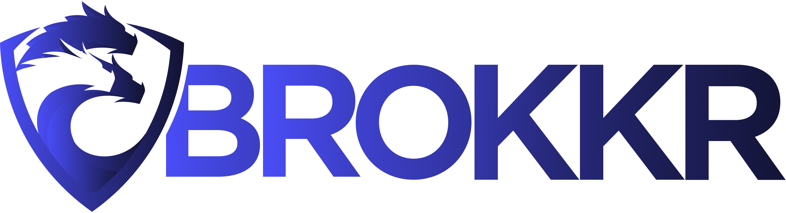

<p align="center">
  <picture>
    <source media="(prefers-color-scheme: dark)" srcset="brand/brokkr-white.png" />
    
  </picture>
</p>

Brokkr is Hydra's bare-metal orchestration platform. This is a **Turborepo monorepo** holding the full stack — the customer-facing hub, the zone-side spoke gateway, the device agent, a CLI, and an in-repo simulated-fleet dev environment — sharing contracts and types via workspace packages.

## Architecture at a glance

Brokkr is **hub-and-spoke**:

- **Hub** (`apps/api`) — the customer-facing NestJS backend + React SPA. Owns the database, auth, billing, and the provisioning sagas. Enqueues work to zones over BullMQ (shared Redis).
- **Spoke / bridge** (`apps/bridge`) — a NestJS gateway that runs in each zone, consumes `saga.run` jobs from the hub, and dispatches operations to devices over gRPC. (A line-for-line TypeScript port of the legacy Python `bridge-api`.)
- **Device agent** (`apps/live-agent`, package `bridge-agent`) — runs on each device, holds a persistent gRPC session to its zone's bridges, and executes named operations.
- **Shared protocol** (`packages/bridge-agent-protocol`) — the Zod schemas for every bridge↔agent operation; the single source of truth for request/response shapes.

Results flow hub-ward through a shared `results:inbox` queue. See [`docs/architecture.md`](./docs/architecture.md) for diagrams (product topology, the local-dev stack, and the bring-up DAG).

**Deploying Brokkr on your own infrastructure?** Start with the [self-hosting guide](apps/docs/content/self-host/docker-compose.mdx), a Docker Compose walkthrough covering the hub, HTTPS, zones, spokes, and adding machines. The [Getting started](#getting-started) section below is the local _development_ environment, which is a different thing.

## Project structure

```
.
├── apps/
│   ├── api/             # NestJS backend (the hub) + serves the web SPA in prod
│   ├── bridge/          # NestJS spoke gateway (Fastify) — zone-side, gRPC dispatch
│   ├── live-agent/      # Device-side agent (@repo name: bridge-agent)
│   ├── cli/             # Brokkr CLI (interactive TUI + one-shot --json commands)
│   ├── web/             # Main React SPA (Vite, TanStack Router/Query, shadcn/ui)
│   ├── local-sim/       # Local-dev simulator engine (Python): libvirt/qemu fleet + ipmi_sim/sushy BMC sim
│   ├── local-lab/       # Local-dev control-center API (NestJS, :3002)
│   └── local-lab-web/   # Local-dev control-center web (Vite, :5175)
├── packages/
│   ├── active-record/   # Tenant-scoped active-record pattern over Prisma
│   ├── api-client/      # Type-safe API client (ts-rest contracts + client)
│   ├── auth/            # Better Auth configuration
│   ├── bridge-agent-protocol/  # Shared Zod schemas for bridge↔agent gRPC envelopes
│   ├── crypto/          # Crypto primitives (authenticated DH, AEAD/AAD helpers)
│   ├── database/        # Prisma client + schema (multi-file)
│   ├── ipam/            # IP address management models
│   ├── plugin-sdk / plugin-runtime / plugins / plugins-config/  # Plugin system
│   ├── ui/              # Shared component library (shadcn/ui + custom)
│   └── utils/           # Shared utilities and Zod schemas
├── devenv/  devenv.nix  Taskfile.yml  .envrc   # In-repo local-dev environment (see below)
└── turbo.json  pnpm-workspace.yaml
```

## Getting started

This repo runs locally on a declarative **devenv** environment — no manual toolchain installs, no Docker for the datastores. If you've never used devenv, read the 60-second primer first; then the from-scratch steps take you from a clean machine to a fully running stack.

### New to devenv? (the 60-second mental model)

A handful of tools work together so that _one command_ brings up the whole stack:

- **Nix** — a package manager that installs an exact, reproducible toolchain (Node, pnpm, Python, qemu, …) pinned per-repo. No "works on my machine".
- **devenv** — describes this repo's environment (the toolchain + the datastores + every process) declaratively in `devenv.nix` + `devenv/modules/*.nix`.
- **direnv** — auto-loads that environment the moment you `cd` into the repo, so the pinned toolchain is on your `PATH` (no `nvm`/`pyenv`/etc.).
- **process-compose** — supervises the running stack (datastores, hub, spoke, control center, fleet) over a socket, restarts crashed processes, and powers `task logs` / `task status`.

The flow: **run the bootstrap once → your shell auto-loads the toolchain → `task up` brings up everything.** The bootstrap even installs Nix/direnv/devenv for you. See the [Glossary](#glossary) for the rest of the vocabulary, and [`docs/architecture.md`](./docs/architecture.md) for diagrams of the whole system.

### Prerequisites

- **OS**: macOS on **Apple Silicon** (Intel Macs are unsupported — the sim VMs are arm64 and need HVF), or **Linux** (x86_64 or arm64, with KVM).
- **git** — for the `git clone` below (HTTPS works anonymously; add an SSH key to GitHub if you prefer the SSH URL). The one-line installer installs it for you on Linux.
- **macOS**: Xcode Command Line Tools (`xcode-select --install`) and Homebrew (the bootstrap uses it to install Docker Desktop); **Docker Desktop must be _running_** — the fleet's iPXE/grub image builds run in containers. The one-line installer handles all three, and waits for the Docker daemon.
- **Linux**: `sudo` access (the bootstrap installs the system virt stack via apt/dnf/pacman — Debian/Ubuntu, Fedora/RHEL, Arch). You also need **docker with the `docker buildx` plugin** — the fleet's iPXE/grub image builds run in containers, and the `docker.io` package alone does not install buildx. The bootstrap installs it.
- **Linux group membership**: the bootstrap adds you to the `libvirt`, `kvm` and `docker` groups. **Log out and back in, or reboot, before you run `task up`.** A new group is not active in the session that ran the bootstrap. `newgrp libvirt` activates one group in one shell, so it does not fix the stack supervisor.
- **Linux under a hypervisor**: the fleet needs `/dev/kvm` in the guest. Turn nested virtualization on, or the fleet falls back to slow TCG software emulation. See [`devenv/README.md`](./devenv/README.md#prerequisites).
- Roughly **16 GB RAM** and a few GB of free disk for the toolchain + fleet overlays.
- Everything else — Nix, direnv, devenv, and the Node/pnpm/Python/qemu toolchain — is installed by the bootstrap or provided by devenv. **You don't install it by hand.**

### From scratch (a fresh machine)

One command does everything below — verify the host, install `git`, Nix, direnv, devenv and the virt stack, clone the repo into `./boss`, and bring the whole stack up:

```bash
curl -fsSL https://raw.githubusercontent.com/Hydra-Host/Brokkr/master/install.sh | sh
```

It asks once, up front, before it needs `sudo`, and it prints exactly what it will do. It is idempotent — if a step fails, or Linux asks you to log back in for your new group membership, re-run the same command and it resumes.

**Expect the first run to take a while.** Building the pinned toolchain is mostly Nix evaluation, which prints nothing on its own for minutes at a time. The installer streams devenv's phase markers (`• Evaluating shell`) and, while those are silent, names the phase it is waiting on every 30 seconds. Set `BROKKR_PROGRESS_INTERVAL` to change the interval (`0` disables it) or `BROKKR_VERBOSE=1` to see devenv's full output. Later runs reuse the cache and are quick.

Tune it with environment variables (or flags, via `| sh -s -- --no-up`):

| Variable          | Flag       | Default                                    | What it does                       |
| ----------------- | ---------- | ------------------------------------------ | ---------------------------------- |
| `BROKKR_REPO_URL` | `--repo`   | `https://github.com/Hydra-Host/Brokkr.git` | Clone a fork or another remote     |
| `BROKKR_REPO_REF` | `--ref`    | the default branch                         | Clone a branch or tag              |
| `BROKKR_DIR`      | `--dir`    | `./boss`                                   | Clone somewhere else               |
| `BROKKR_NO_UP=1`  | `--no-up`  | unset                                      | Stop once the environment is ready |
| `BROKKR_YES=1`    | `--yes`    | unset                                      | Never prompt (unattended)          |
| `BROKKR_LOG`      | `--log`    | `~/.local/state/brokkr-local/logs/`        | Write the run log somewhere else   |
| `BROKKR_NO_LOG=1` | `--no-log` | unset                                      | Write no run log                   |
| `BROKKR_LOG_KEEP` |            | `10`                                       | Number of run logs to keep         |

Every run also writes a log to `~/.local/state/brokkr-local/logs/install-<timestamp>.log`, with `latest.log` pointing at the newest and the 10 newest kept. It holds the same narrative plus devenv's **complete** output, including the lines the terminal view filters out, so a run that fails leaves something to attach to a bug report.

The installer never handles a credential. Pointing it at a private remote reuses whatever `git` already has — an SSH agent, or a stored HTTPS credential.

**Clone somewhere your container runtime can read.** Run the command from your home directory, or set `BROKKR_DIR` to a path under it. The fleet builds its GRUB and iPXE artifacts in a container and bind-mounts files straight out of the checkout, and Docker Desktop, Lima and Colima share your home directory by default but **not `/tmp`**. A checkout under `/tmp` clones and builds fine, then fails minutes later with `/build.sh: Is a directory`.

<details>
<summary><b>Prefer to run the steps yourself?</b> Here is exactly what the installer does.</summary>

> **Already have `task` (go-task) on your PATH?** You don't need to run the bootstrap script by hand — `task up` runs it for you (idempotently; the host bootstrap is the first thing it does). Skip step 2 below: `cd` into the repo so direnv loads the devenv, then run `task local:setup` (for the SSH key) and `task up`. The script in step 2 is the from-nothing path — it's what installs the devenv toolchain (including `task` itself) on a machine that doesn't have it yet.

```bash
# 1. Clone the repo
git clone https://github.com/Hydra-Host/Brokkr.git
cd Brokkr

# 2. One-time host bootstrap (idempotent). Installs Nix + direnv + devenv, wires the direnv
#    shell hook, runs `direnv allow`, and installs the OS-level virt stack (libvirt/qemu;
#    Docker Desktop on macOS). Expect one or two sudo prompts.
bash apps/local-sim/provisioning/bootstrap.sh

# 3. Open a fresh shell so the direnv hook loads.
exec $SHELL
#    Linux only: the bootstrap adds you to the libvirt, kvm and docker groups. A new group is not
#    active in this session. Log out and back in, or reboot, then continue. `newgrp libvirt`
#    activates one group in one shell, so it does not fix the stack supervisor.

# 4. Enter the repo — direnv auto-loads the devenv and builds the toolchain (first run is slow,
#    a few minutes; later entries are instant). If direnv says the .envrc is untrusted, run
#    `direnv allow` (the bootstrap normally does this for you).
cd Brokkr

# 5. Onboarding (idempotent): creates your SSH key if absent (used for discovery SSH into the
#    sim VMs); in a polyrepo layout it also clones the hub checkout. In this monorepo the hub
#    checkout is *this* repo, so it mostly just makes the key.
task local:setup

# 6. (Optional) Readiness report — checkout, SSH key, Docker running, group membership.
task local:doctor

# 7. Bring up the whole stack. The first `task up` installs a one-time scoped passwordless-sudo
#    drop-in (one prompt) for the few privileged sim operations, then brings up everything.
task up
```

</details>

> `task up` is idempotent — re-run it anytime to reconcile a wedged stack. It runs the host bootstrap (a no-op when nothing changed), then `devenv up -d` (detached): native Postgres/Redis/nginx, the hub + spoke, the control center, seed data, and the simulated fleet. The default needs **no Vault and no internal credentials** — every secret resolves from `secretspec.toml`'s `local` profile. It is not offline, though: a public, Hydra-operated CDN (`brokkr.assets.hydra.host`, no account, no token) serves the discovery OS and the OS layers. See [external assets and override knobs](./devenv/README.md#external-assets-and-override-knobs) to point that elsewhere.

**Is it up?** The first `task up` takes several minutes (it builds images and seeds data); later runs are quick. When it finishes you'll see `✓ Stack reconciled.` followed by a line pointing at the control center / hub / spoke. Check health anytime with `task status` (every process should be Running/healthy) — if something is down, just re-run `task up` to reconcile.

### What just came up

| URL / port                        | Service                                                   |
| --------------------------------- | --------------------------------------------------------- |
| **http://localhost:5175**         | **Control center** — web cockpit to drive the whole stack |
| http://localhost:3002             | Control-center API                                        |
| http://localhost:5173             | Hub web (customer SPA)                                    |
| http://localhost:3000             | Hub API                                                   |
| http://localhost:3000/api/swagger | Hub OpenAPI docs (ReDoc at `/api/redoc`)                  |
| :8000 · :9082                     | Spoke (bridge) HTTP · gRPC                                |
| :5432 · :6379 · :8888             | Postgres · Redis · nginx OS-layer cache                   |

Ports are declared once in `devenv/modules/ports.nix`. The web/API bind `0.0.0.0`, so the control center is reachable over LAN/Tailscale (and is mobile-responsive). Open **http://localhost:5175** and drive everything — process supervision, fleet power/console, the e2e test suite — from the UI.

### First-time login

The local stack seeds three BoSS organization accounts for capability testing:

- `brokkr@brokkr.local` — Owner
- `brokkr-2@brokkr.local` — Admin
- `brokkr-1@brokkr.local` — Member

All three use the local-only password `brokkr`.

The **control center** (http://localhost:5175) is the main entry point — power VMs, watch consoles, run the test suite. The **hub web** (http://localhost:5173) is where that login lands for the customer-facing app.

### Day-to-day

```bash
task up            # bring up / reconcile the stack (idempotent)
task status        # one-shot: process list + fleet status table
task logs          # attach the process-compose TUI (live logs/health; q detaches)
task down          # stop the stack
task local:reset   # DESTRUCTIVE: down + wipe datastore data + fleet overlays
task local:purge   # DESTRUCTIVE: reset + nginx cache + logs + task db

# Fleet ops
task sim:node:console NAME=<node>   # tail a node's serial console
task sim:ipmi    -- <node> <cmd>    # ipmitool passthrough (e.g. cpu-1 chassis power on)
task sim:redfish -- <node> <verb>   # Redfish passthrough (e.g. cpu-1 power-on)
```

### Running more than one stack

Every checkout claims a **slot** (0–46) from the host registry on its first `task up`. The slot derives the whole stack: its port block (`20000 + 500 × slot`), its data-plane subnet (`192.168.(200 + slot).0/24`), its node names, and its state directories. A second checkout therefore comes up beside the first with no port edits. Slot 0 keeps the legacy ports listed above. Slots 1 and up get a single-node fleet by default.

```bash
task local:status   # the host stacks table — every claimed slot and its checkout
task down:others    # stop the sibling stacks, leave this one up
task down:all       # stop every registered stack
task purge:all      # DESTRUCTIVE: wipe every slot's host-global state
task stack:release  # DESTRUCTIVE: tear this checkout's stack down and return its slot
task stack:reslot   # DESTRUCTIVE: move this checkout to another slot
```

`task up` does not stop siblings. It reports them. Mind the reach: `down:others`, `down:all` and `purge:all` act on every registered stack, so they stop other checkouts' work; the two `stack:*` verbs act on this checkout only. For the full slot model see [`devenv/README.md`](./devenv/README.md).

### Driving the control center

The cockpit on :5175 groups its pages into five areas. **Environment** holds the landing **Overview** plus **Stack**, **Datastore**, **Hub**, **Storage**, **Fleet** and **Layers**. **Testing** holds **Scenarios** and **Results**. **Configuration** holds a change **Summary**, **Stack knobs**, **Fleet nodes**, **Zones & topology** and **Advanced** — a save there writes your overlay, and a shared panel names the apply that makes the stack read it. **Apps** links to the running web UIs. **Reference** holds the **API docs**, the **Audit log**, the self-hosting guide and the in-app **wiki** (`/wiki`). Three guided decks start from the header: an orientation tour, a **Guided Deploy** that drives the real controls, and an operations walkthrough.

The same control surface is available to an AI agent over MCP. Registration is automatic — every checkout gets the `brokkr-lab` entry from tracked devenv, with no manual add step.

Destructive tools are not registered unless you set `LAB_MCP_ALLOW_DESTRUCTIVE=1`, and every mutation lands in the audit log. See [`apps/local-lab-mcp/README.md`](./apps/local-lab-mcp/README.md).

For configuration (override layers, fleet topology, ports), the secrets contract, platform specifics, and troubleshooting, see the operator guide: [`devenv/README.md`](./devenv/README.md).

### Troubleshooting (first run)

- **`bootstrap.sh` failed** → see [`devenv/README.md`](./devenv/README.md) → Troubleshooting.
- **direnv says the `.envrc` is untrusted** → run `direnv allow`, then `cd` back in.
- **`task up` errored or a process is down** → run `task logs` (live TUI) to see why, then re-run `task up` to reconcile.
- **`task up` fails on a port already in use** → a stale `dist/main` is squatting it; the preflight auto-reaps brokkr-owned orphans, otherwise stop the listener and retry.
- **The fleet fails with `/build.sh: Is a directory` and `exit status 126`** → your checkout is outside the directories your container runtime shares. The fleet builds its GRUB and iPXE artifacts in a container and bind-mounts files from the checkout; Docker Desktop, Lima and Colima all share your home directory by default, but **not `/tmp`**. When the runtime cannot see the source path it mounts an empty directory in its place, so `bash /build.sh` gets a directory. Clone under your home directory, or add the checkout's path to the runtime's file-sharing list.
- **Need a clean slate** → `task local:reset` wipes datastore data + fleet overlays for a fresh rebuild (destructive). Full list in [`devenv/README.md`](./devenv/README.md) → Troubleshooting.

### Running the apps directly (without the full stack)

When you just want the app processes against datastores you already have running (e.g. via the devenv):

```bash
pnpm dev                         # hub api + web (ports 3000 / 5173)
pnpm --filter bridge dev         # the spoke gateway (watch)
pnpm --filter bridge-agent dev   # the device agent (watch)
pnpm brokkr <command>            # run the CLI (tsx apps/cli/src/index.ts)
```

`pnpm dev` does **not** start the bridge or live-agent — run those per-filter.

### Database

Under the devenv stack, Postgres is a **native devenv service** that `task up` brings up and migrates — you don't provision it by hand. The Prisma scripts in `packages/database` are for schema work against it; `pnpm db:init` is the standalone alternative (spins up Postgres in Docker, no devenv):

| Command                  | Description                                             |
| ------------------------ | ------------------------------------------------------- |
| `pnpm db:init`           | Initialize a standalone PostgreSQL via Docker + migrate |
| `pnpm db:generate`       | Generate the Prisma client                              |
| `pnpm db:migrate`        | Create and run migrations (development)                 |
| `pnpm db:migrate:deploy` | Apply pending migrations (production)                   |
| `pnpm db:push`           | Push schema changes without a migration (prototyping)   |
| `pnpm db:studio`         | Open Prisma Studio                                      |

The schema is **multi-file** under `packages/database/prisma/models/`. Run `pnpm db:generate` after changing it, and update `packages/database/SCHEMA_DIAGRAM.md` when models/relations change.

### Glossary

| Term                     | What it is                                                                         |
| ------------------------ | ---------------------------------------------------------------------------------- |
| **Nix**                  | Reproducible package manager; pins the exact toolchain per repo.                   |
| **devenv**               | Declares this repo's environment (`devenv.nix` + `devenv/modules/*.nix`).          |
| **direnv**               | Auto-loads the devenv when you `cd` in (via the committed `.envrc`).               |
| **process-compose**      | Supervises the running stack; backs `task logs` / `task status`.                   |
| **Taskfile**             | The lifecycle verbs (`task up`, `task down`, `task sim:*`) in `Taskfile.yml`.      |
| **hub / spoke / agent**  | The product: customer backend / zone gateway / device agent.                       |
| **fleet**                | The simulated libvirt/qemu device VMs (`apps/local-sim`).                          |
| **ipmi_sim / sushy**     | Simulated BMCs — IPMI (OpenIPMI `ipmi_sim`) / Redfish (`sushy`).                   |
| **control center**       | The local-dev web cockpit (`apps/local-lab` + `apps/local-lab-web`).               |
| **secretspec / profile** | The secrets contract (`secretspec.toml`); `local` (hermetic) vs `dev` / `stg`.     |
| **polyrepo seam**        | `config.polyrepo.hub.path` — where the hub checkout lives (defaults to this repo). |

> There is no `pnpm setup` / root `docker compose` flow and no root `docker-compose.yml`. Use the devenv environment above for local infra.

## Common commands

| Command                           | Description                                                                             |
| --------------------------------- | --------------------------------------------------------------------------------------- |
| `pnpm dev`                        | Start the hub api + web in dev mode                                                     |
| `pnpm build`                      | Build all apps and packages (Turborepo)                                                 |
| `pnpm lint`                       | Lint all apps and packages                                                              |
| `pnpm format`                     | Format with Prettier                                                                    |
| `pnpm typecheck`                  | Type-check all packages (run before committing — the SWC dev build does not type-check) |
| `pnpm test`                       | Run tests (Vitest)                                                                      |
| `pnpm brokkr <cmd>`               | Run the Brokkr CLI                                                                      |
| `pnpm gen:record`                 | Generate an active-record class                                                         |
| `pnpm --filter api docs:generate` | Generate the public OpenAPI spec JSON                                                   |

## Type-safe API (ts-rest)

End-to-end type safety between the NestJS backend and frontend clients lives in `packages/api-client` ([ts-rest](https://ts-rest.com/)). Contracts are split per domain under `src/contract/`, schemas under `src/schemas/`.

**Server (NestJS controller):**

```typescript
import { Controller } from '@nestjs/common';
import { TsRestHandler, tsRestHandler } from '@ts-rest/nest';
import { contract, type User } from '@repo/api-client';

@Controller()
export class AppController {
  @TsRestHandler(contract.getMe)
  getMe(@CurrentUser() user: User) {
    return tsRestHandler(contract.getMe, async () => ({ status: 200, body: user }));
  }
}
```

**Client (React + TanStack Query):**

```typescript
import { tsr } from '@/main';

const { data, isLoading } = tsr.getMe.useQuery({ queryKey: ['me'] });
const mutation = tsr.createPost.useMutation();
```

**Adding an endpoint:** add the Zod schema to `packages/api-client/src/schemas/<domain>.ts`, the route to `src/contract/<domain>.ts`, wire it into the contract index, implement the `@TsRestHandler` in the controller, then `pnpm build`. Every endpoint needs a `summary` + `description`, and every schema field a `.describe(...)` — these power the generated OpenAPI docs.

## Authentication

Built with [Better Auth](https://www.better-auth.com/) (`packages/auth`): email/password, multi-tenant organizations, and a global `UnifiedIdentityGuard` on the hub.

```typescript
import { signIn, signUp, signOut, useSession } from '@repo/auth/client';

await signUp.email({ email, password, name });
await signIn.email({ email, password });
const { data: session } = useSession();
```

```bash
BETTER_AUTH_SECRET="your-secret-key-min-32-chars"   # openssl rand -base64 32
BETTER_AUTH_URL="http://localhost:3000"
```

## Local simulation flag (`LOCAL_SIMULATION_ENABLED`)

When running the hub API against the in-repo sim fleet (no real NetBox or Stripe), set `LOCAL_SIMULATION_ENABLED=true` in the API env. It's read by `isLocalSimulationEnabled()` (`apps/api/src/common/local-simulation.ts`) and bypasses three provision-flow checks that need external infrastructure the sim lacks:

- **Stripe contract term** (`create-reservation-and-deployment`) — substitutes a placeholder `stripeProductId` instead of throwing when a sim `Server` row has none.
- **NetBox VPC assignment** (`assign-device-to-vpc`) — skips the NetBox `getLocationById` lookup (sim zones are flat; the call would otherwise retry then 404).
- **Netplan publish** (`provision.service`) — skips publishing the NetBox-int-keyed netplan to Redis (sim devices have no real NetBox mirror).

Set it before starting the API (e.g. `LOCAL_SIMULATION_ENABLED=true pnpm dev`, or in `apps/api/.env`). **Off by default** — with the flag unset (production default) all three checks behave normally. **Never enable it in a shared or production environment.**

## API documentation

The OpenAPI spec is generated from the shared ts-rest contract:

- Runtime docs UI (hub running): `/api/swagger` and `/api/redoc`
- Offline spec generation: `pnpm --filter api docs:generate` → `apps/api/openapi/public.json`

`apps/api/src/common/openapi.ts` builds the document; `generate-openapi.ts` produces it without booting Nest; `docs-setup.ts` wires the runtime routes.

## Testing

This project uses [Vitest](https://vitest.dev/) with [SWC](https://swc.rs/) for NestJS decorator support.

```bash
pnpm test                                                # all tests (Turborepo)
cd apps/api && pnpm test:watch                           # watch mode
cd apps/api && npx vitest run src/path/to/file.spec.ts   # a single file
```

- Unit tests live beside source as `*.spec.ts` / `*.test.ts`.
- The bridge has a composition-root integration suite (`pnpm --filter bridge test:integration`).
- **Type errors don't surface in `pnpm dev`** (the API runs under SWC with type-checking off). Always run `pnpm typecheck` before committing.

## Adding shadcn/ui components

```bash
cd apps/web
pnpm dlx shadcn@latest add <component-name>
```

## Contributing

Contributions are welcome. Brokkr is developed in the open on **GitHub** — fork
the repository, create a branch, and open a pull request against the default
branch:

```bash
git clone https://github.com/<your-fork>/Brokkr.git
cd Brokkr
git checkout -b my-change
# make your changes, then push your branch and open a Pull Request
```

Commits follow **Conventional Commits** with an **all-lowercase subject** (enforced by commitlint).

For the full contribution workflow and build/test conventions, see
[CONTRIBUTING.md](./CONTRIBUTING.md). For plugin development, see
[CONTRIBUTING-PLUGINS.md](./CONTRIBUTING-PLUGINS.md). Please review our
[Code of Conduct](./CODE_OF_CONDUCT.md), and report security issues privately
via [SECURITY.md](./SECURITY.md) — do not open a public issue for vulnerabilities.

## Tech stack

- **Runtime / tooling**: Node.js ≥ 18, pnpm workspaces, Turborepo, devenv/Nix for local-dev
- **Backend**: NestJS 11 — hub on Express, spoke (bridge) on Fastify
- **Frontend**: React 19, TanStack Router + Query, Vite 7, Tailwind CSS v4, shadcn/ui
- **Inter-service**: BullMQ over Redis (hub↔spoke), gRPC (spoke↔agent), Zod-validated envelopes
- **API client**: ts-rest with Zod validation and `@ts-rest/react-query`
- **Database**: Prisma 7, PostgreSQL
- **Auth**: Better Auth (email/password + multi-tenant organizations)
- **Testing**: Vitest with SWC

## License

Brokkr is licensed under the [Apache License 2.0](./LICENSE). Every app and package in this
repository ships under that license. Proprietary components of the Hydra Host managed edition are
not part of this distribution. See [LICENSING.md](./LICENSING.md) for per-package details, and
[`packages/crypto/NOTICE`](./packages/crypto/NOTICE) for the export-control posture of the
cryptography package (ECCN 5D002).

## Useful links

- [NestJS](https://docs.nestjs.com/) · [TanStack Router](https://tanstack.com/router/latest) · [TanStack Query](https://tanstack.com/query/latest)
- [ts-rest](https://ts-rest.com/) · [Prisma](https://www.prisma.io/docs/) · [Better Auth](https://www.better-auth.com/docs/)
- [shadcn/ui](https://ui.shadcn.com/) · [Tailwind CSS](https://tailwindcss.com/) · [Turborepo](https://turborepo.dev/)
