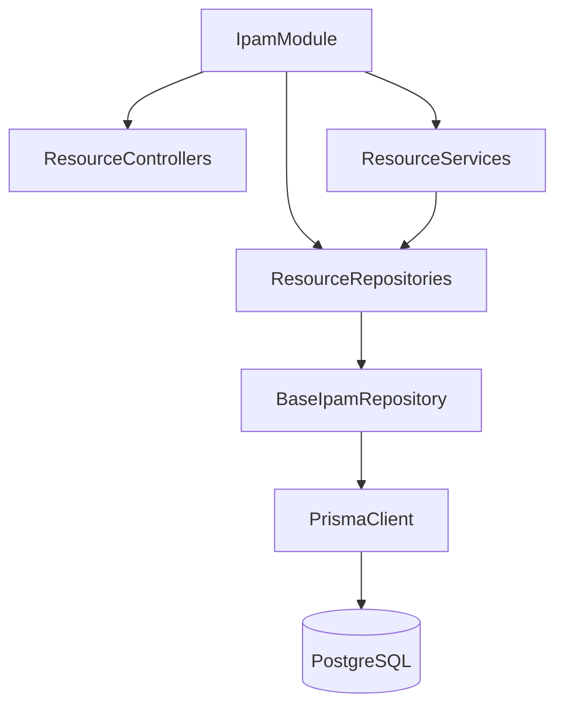
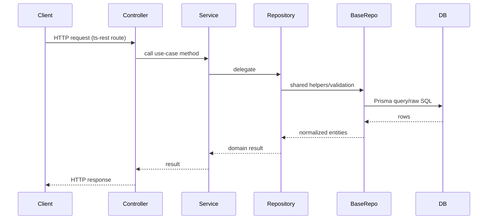
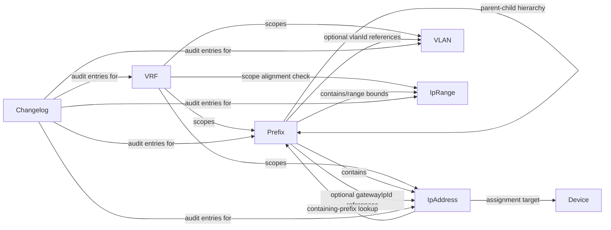
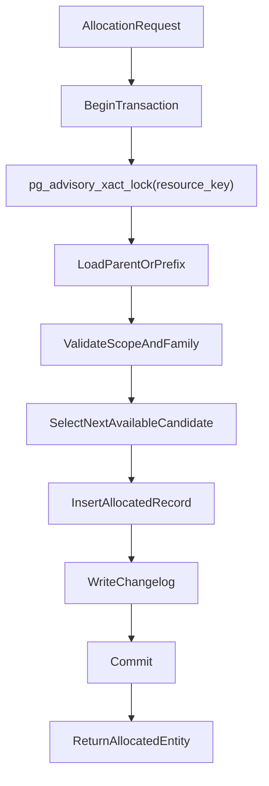

# IPAM Module

This module implements IP Address Management (IPAM) for:

- VRFs
- Prefixes
- IP addresses
- VLANs
- IP ranges
- IPAM changelog/audit history

It is organized by resource type, with each resource having its own controller, service, and repository. Shared cross-resource validation and mapping logic is centralized in the shared base repository.

## Directory Layout

```text
apps/api/src/ipam
├── ipam.module.ts
├── __test__/
├── shared/
│   ├── base-ipam.repository.ts
│   └── ipam.types.ts
├── vrf/
├── prefix/
├── ip-address/
├── vlan/
├── ip-range/
└── changelog/
```

## High-Level Architecture



## Request Flow

For every route:

1. **Controller** binds ts-rest route contracts and converts handler output to HTTP shape.
2. **Service** is a thin orchestration layer that delegates to one repository.
3. **Repository** executes business logic, validation, and SQL/Prisma operations.
4. **Base repository** provides shared behavior used by all repositories.



## Resource Responsibilities

- **`vrf/`**
  - CRUD for VRFs
  - Enforces uniqueness by name/RD within organization scope
- **`prefix/`**
  - Prefix CRUD, hierarchy, overlap checks, child lookup
  - Prefix utilization
  - Next-prefix allocation (IPv4)
  - Gateway association and validation
- **`ip-address/`**
  - IP CRUD, object assignment management
  - Next-IP allocation from pool prefixes (IPv4)
  - Stale/duplicate assignment detection
  - Find containing prefix for an IP
- **`vlan/`**
  - VLAN CRUD and uniqueness checks (VID/name in scope)
- **`ip-range/`**
  - Range CRUD and overlap detection within prefix/VRF scope
- **`changelog/`**
  - Read changelog entries for IPAM tables

## Resource Relationships



## Shared Base Repository (`shared/base-ipam.repository.ts`)

The base repository provides:

- Shared Prisma wrappers (`queryRaw`, `executeRaw`, `transaction`)
- Common entity lookup guards (`requireVrf`, `requirePrefix`, `requireIpAddress`, etc.)
- Cross-resource validation helpers:
  - parent prefix containment
  - VLAN/VRF compatibility
  - gateway/prefix consistency
  - IP range bounds and scope checks
- Input normalization:
  - CIDR normalization (`::cidr::text`)
  - IP normalization (`::inet::text`)
- Mapping helpers for row-to-contract conversion
- Audit/changelog writer and JSON diff generation
- IPv4 utility helpers for allocation logic

## Data and Scope Rules

Most queries are scoped by:

- `organizationId` from `ContextService`
- `deletedAt IS NULL` for active records
- optional VRF scoping using `IS NOT DISTINCT FROM` for nullable VRF IDs

This keeps logic multi-tenant and consistent for nullable VRF semantics.

## Transaction and Allocation Behavior

Allocation methods use DB transactions with advisory locks to avoid concurrent collisions.



## Changelog / Audit Model

Mutating operations generally append to `Changelog`:

- `tableName`
- `pk`
- `before`
- `after`
- `diff`

This provides a lightweight audit trail across VRF, Prefix, IP Address, VLAN, and IP Range changes.

## Tests

Current tests live in `__test__/`:

- `ipam.service.spec.ts`: business-logic validations across repositories
- `ipam.module.spec.ts`: delegation coverage for all service methods

When adding new business logic, prefer adding repository-level tests first (behavior), then service/controller tests only when orchestration/route behavior changes.

## Extending the Module

When adding a new IPAM feature:

1. Add/extend ts-rest contract in `@repo/api-client`.
2. Implement repository behavior in the owning resource folder.
3. Add service delegation and controller handler.
4. Reuse base helpers when possible; add shared helper only if needed by multiple resources.
5. Add tests in `apps/api/src/ipam/__test__/`.
