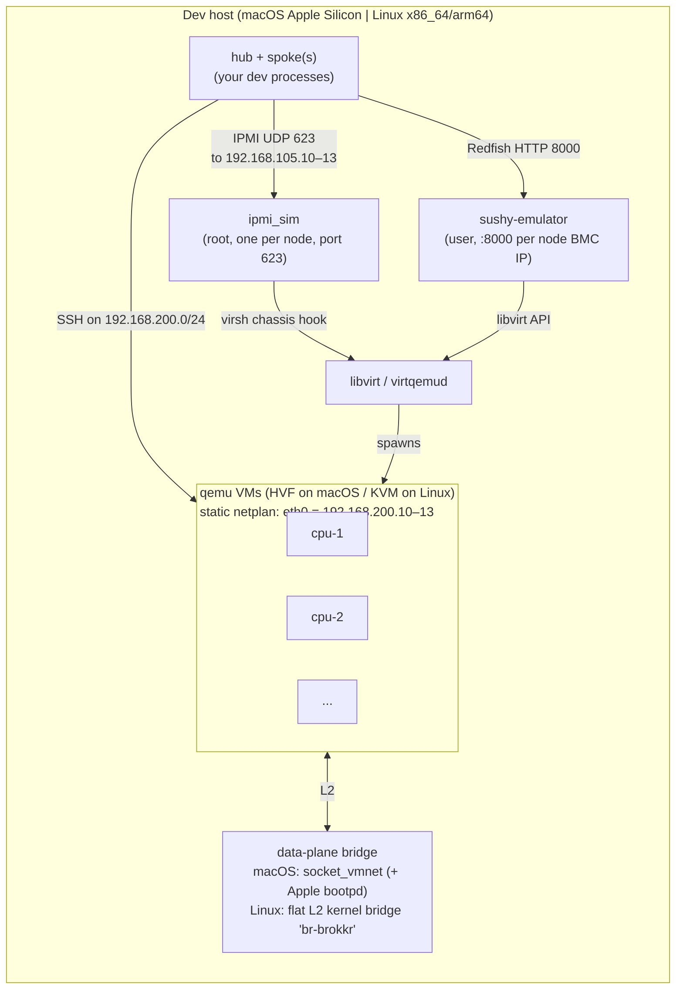
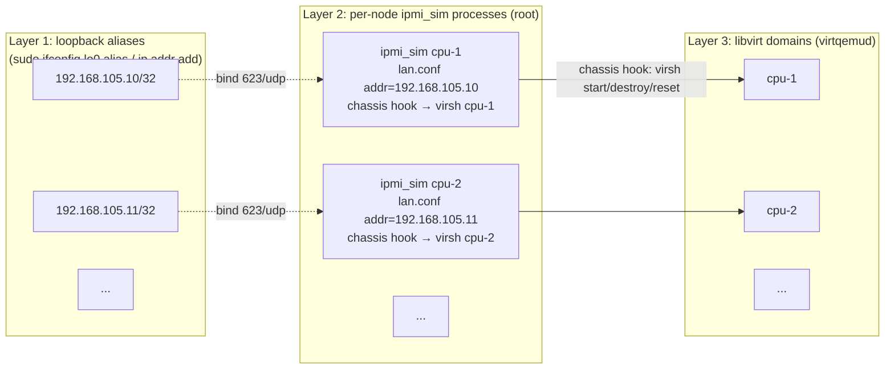
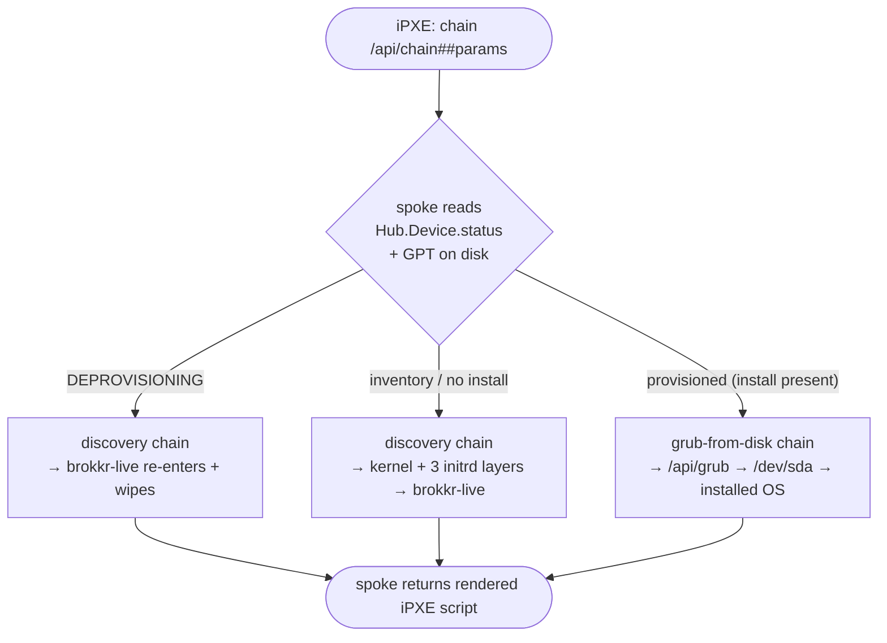
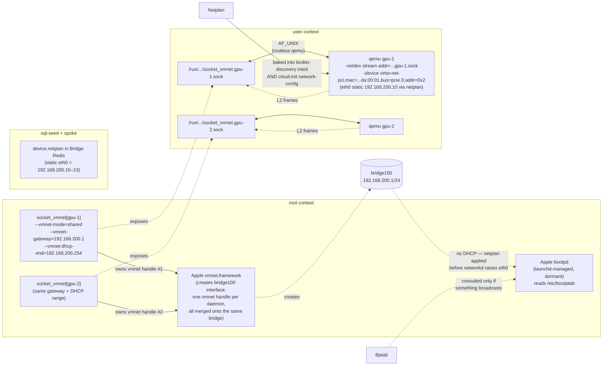

# Architecture

How the simulated fleet boots, how IPMI gets routed to a libvirt domain, and how the data plane assigns IPs — with diagrams.

`README.md` covers what the sim **gives you**. This doc covers what it **does**. `CLAUDE.md` (next to this file) is the authoritative reference for engine internals.

The sim is **cross-platform**. Where macOS and Linux diverge (accelerator, data-plane plumbing, firmware paths), it's called out. Defaults below show the macOS shape with the Linux equivalent noted; `templates/domain.xml.j2` and `host_os.py` are the source of truth for the split.

## 1. Bird's-eye view: the daemons and what they own



Two planes, both host-routable:

| Plane         | CIDR (default)     | Where it lives                                                                                                                                                                  | Who binds                                                                                              |
| ------------- | ------------------ | ------------------------------------------------------------------------------------------------------------------------------------------------------------------------------- | ------------------------------------------------------------------------------------------------------ |
| **BMC** (OOB) | `192.168.105.0/24` | loopback IPv4 aliases (lo0 on macOS, lo on Linux)                                                                                                                               | `ipmi_sim` (IPMI 623, one per node), `sushy-emulator` (Redfish 8000)                                   |
| **Data**      | `192.168.200.0/24` | macOS: Apple vmnet bridge fronted by a `socket_vmnet` UNIX socket. Linux: flat L2 kernel bridge `br-brokkr` (no libvirt network, no dnsmasq, no DHCP; NAT out the host uplink). | VMs' `virtio-net-pci` on `pcie.0:0x2` (iPXE needs PCI, not MMIO); static netplan from `device.netplan` |

The BMC plane is pure loopback (no real interface). The data plane is a real bridge interface the host can route to.

## 2. Boot pipeline: from `fleet:init` + `fleet:up` to a running brokkr-live

The sim doesn't TFTP-PXE-boot and doesn't use Redfish virtual media. It **direct-loads a per-VM iPXE EFI binary** via qemu's `<kernel>`; iPXE brings up the NIC with its static IP and **chains to the spoke's `/api/chain`**, which renders the boot script server-side (kernel + multi-layer initrd for discovery, or grub-from-disk for a provisioned device). No firmware-side PXE/TFTP, no `<initrd>`/`<cmdline>` in the libvirt XML, no per-VM cpio assembly on the host side.

The flow splits into two CLI subcommands: **`fleet:init`** (slow path — build the shared initrds + grub binaries, warm each spoke's cache, build the per-VM iPXE binaries) and **`fleet:up`** (fast path — render XMLs + start daemons + start a per-node ipmi_sim/sushy + auto-power-on). The **seed runs before `fleet:init`** (the `sim:seed` devenv task in the `devenv up` DAG), not inside it.

### 2.1 Boot ingredients (per arch + per VM)

```
~/.local/share/local/boot/aarch64/      (amd64/ on Linux x86_64)
├── ipxe-cpu-1.efi          ← per-VM iPXE binary — qemu loads this as <kernel>.
├── ipxe-cpu-2.efi             docker-built; embed script sets static IP + chains to /api/chain.
├── ...
├── ipxe-cpu-1.ipxe         ← embed-script sidecar (byte-compared on rebuild for idempotency)
└── ...

/tmp/brokkr-dev/initrd-builds/          (persistent_storage; native cpio builds)
├── brokkr-live.img         ← discovery overlay (cpio newc from $SPOKE_REPO_PATH/boot/initrd-live)
└── bridge-agent.img        ← agent bundle + its systemd unit

  + grub boot-from-disk binaries under the spoke repo's assets dir (served at /api/grub)
```

**The only host-side file strictly required for VM boot is `ipxe-{node}.efi`** — qemu's `<kernel>` loads it directly from the host filesystem. Everything else (the actual `vmlinuz`, the Ubuntu base `initrd.img`, the per-VM `brokkr-discovery-{UUID}.img`, `brokkr-live.img`) is served by the spoke over HTTP _after_ the VM is alive on the data plane. The host-side prefetch (`prefetch.py`) just warms each spoke's cache so the first GET is a hit and doubles as a reachability smoke-test.

**Discovery initrds are keyed by `Hub.Device.id` (UUID)** — `brokkr-discovery-{UUID}.img`. `fleet.py:_node_device_ids()` joins `fleet.yml` ↔ Hub by BMC IP to resolve each node's UUID at `fleet:init` time; the per-VM iPXE embed and the prefetch both use it.

Per-VM iPXE binaries differ per node because the embed script bakes in the node's static IP and the spoke base URL with the data-plane gateway substituted for `127.0.0.1` (the VM's localhost isn't the host's — see `pxe._vm_reachable_bridge_url`). For multi-zone runs the base URL also carries the node's zone HTTP port. `pxe.build_ipxe_for_node` writes the embed script to a sidecar `.ipxe` file and byte-compares on the next call — rebuild (docker buildx) fires only when the script changes.

### 2.2 Boot-time sequence

```mermaid
sequenceDiagram
  participant U as User
  participant Fleet as fleet.py
  participant Seed as "sim:seed<br/>(generators → psql)"
  participant Spoke as "spoke<br/>(localhost:8000+zone)"
  participant Hub as "Hub Postgres"
  participant FS as "~/.local/share/local/"
  participant Libvirt as libvirt
  participant Qemu as "qemu (HVF/KVM)"
  participant IPXE as "iPXE (inside VM)"

  Note over U,IPXE: devenv up → sim:seed (once, before fleet:init)
  Seed->>Hub: Zone + per-VM Device (status=ACTIVE, role=Server) + Server.storageLayouts<br/>+ netplanOverride + StorageDrive; OS catalog; SshKeys; listing
  Note over Hub,Spoke: spoke synthesizes its Bridge Redis device record from Hub state on-miss

  Note over U,IPXE: Phase 1 — task fleet:init (slow path)
  U->>Fleet: task fleet:init
  Fleet->>FS: native cpio build brokkr-live.img + bridge-agent.img; build grub bins
  Fleet->>Hub: _node_device_ids() — join fleet.yml ↔ Hub by BMC IP → name→Device.id (UUID)
  loop For each VM (round-robin onto zones)
    Fleet->>Spoke: GET /api/initrd/brokkr-discovery-{UUID}.img  (warm cache; spoke builds on-miss)
    Fleet->>Qemu: docker buildx — compile per-VM iPXE binary with embed script
    Qemu-->>FS: boot/<arch>/ipxe-{name}.efi
  end

  Note over U,IPXE: Phase 2 — task fleet:up (fast path)
  U->>Fleet: task fleet:up
  Fleet->>FS: render domain XML (<kernel> = boot/<arch>/ipxe-{name}.efi); /etc/bootptab (macOS fallback)
  Fleet->>Libvirt: virsh define + virsh start (auto-power-on)
  Libvirt->>Qemu: qemu -accel hvf|kvm -kernel ipxe-{name}.efi (no -initrd, no -append)
  Qemu->>IPXE: load iPXE EFI, run embed script
  IPXE->>IPXE: bring up net0 with static IP/gw/netmask
  IPXE->>Spoke: chain --autofree ${base}/api/chain##params (platform/arch/ip/mac/serial/ipmi_*)
  Spoke-->>IPXE: rendered iPXE script — kernel + 3 initrd layers (discovery) OR grub-from-disk
  IPXE->>Spoke: HTTP GET the artifacts the script names (cache hits — warmed in Phase 1)
  IPXE->>Qemu: chainload kernel + initrds; casper boots; static netplan applied
  Qemu-->>U: brokkr-live at 192.168.200.10, SSH-reachable from the host
```

### 2.3 The boot decision lives in the spoke's `/api/chain`, not the embed script

There is no `<cmdline>` in the domain XML and the embed script carries **no** kernel/initrd URLs. The embed script (`pxe._embed_script`) only:

1. Sets `net0` static IP / netmask / gateway and `ifopen`s it.
2. Collects system params (`platform`, `buildarch`, `ip`, `mac`, `serial`, `ipmi_mac`, `ipmi_ip`, `system_uuid`, …).
3. `chain --autofree ${base}/api/chain##params` — handing the boot decision to the spoke, with a `:retry` loop on failure.

The spoke's `/api/chain` is what decides — and renders the actual `kernel`/`initrd`/cmdline lines. For a device still in inventory it returns the discovery chain (Ubuntu base `initrd.img` + per-VM `brokkr-discovery-{UUID}.img` + `brokkr-live.img`, casper `netboot=url`, static `ip=`). For a provisioned device it returns the disk chain, which itself chains `/api/grub` (the grub boot-from-disk binaries built by `grub_build.py`). This mirrors production iPXE chainload — we just direct-load a per-VM iPXE binary instead of chainloading a script over TFTP, because there's no TFTP server in the loop.

The kernel reads the boot blob as a stream of cpio archives until a non-cpio block; each later archive overlays the earlier ones. The static `ip=` pins eth0 without DHCP-time bookkeeping; the match-by-MAC netplan baked into the discovery initrd takes over once casper hands off to networkd.

## 3. IPMI plane: how `chassis power on cpu-1` reaches the VM

No proxy, no gateway, no interceptor — just BSD-socket routing. Each VM's BMC is its own OpenIPMI `ipmi_sim` process (lanserv), bound to its own loopback alias IP:623.

### 3.1 Three layers of binding



Routing is purely by destination IP: a UDP packet to `192.168.105.10:623` is delivered by the kernel to the `ipmi_sim` process bound there; its `lan.conf` `chassis_control` hook names the libvirt domain it drives.

### 3.2 What `start_ipmi_sim` does

`fleet.py:_setup_one_node`, once per node:

1. add the loopback alias so the IP exists on the host.
2. `daemons.start_ipmi_sim(node, bmc)` renders a per-node lanserv config (`state/ipmi-sim/<node>/lan.conf`) — binding `<bmc>:623`, the BMC user/password, and a `chassis_control` line pointing at `ipmi-sim-chassisctl.py <virsh> <domain> <libvirt-uri> <statedir>` — plus a minimal `sim.emu`, then `sudo`-launches `ipmi_sim -c lan.conf -f sim.emu -s state -n` (root, for port 623) by absolute store path.

There's no separate CLI or control port and no persisted registration: the per-node config dir under `state/ipmi-sim/<node>` _is_ the registration (`ipmi_sim_registered_names` enumerates it for teardown). Power ops actuate the VM only through the chassis hook shelling to `virsh`.

**Why the explicit `qemu+unix:///session?socket=...` URI** (`daemons.py:libvirt_uri_for_root`, baked into the `chassis_control` line): ipmi_sim runs as root, so a bare `qemu:///session` would resolve to root's session, not the user's — the explicit socket path points the hook at the user's virtqemud (which owns the VMs). On Linux the system instance (`qemu:///system`) is used instead.

## 4. IPMI `chassis bootdev` is BMC-compat only — the spoke decides what boots

In production, `bootdev=pxe` means "PXE-boot on next start." Bridge always sends `bootdev=pxe` (`bridge/config/lifecycle.py:default_boot_device = "pxe"`) and relies on the iPXE chain to pick disk-vs-network. The sim does the same — ipmi_sim's chassis hook **persists** the `chassis bootdev` to a `statedir/bootdev` file so the bridge's set-then-verify round-trip (`chassis bootdev X` then `bootparam get 5`) echoes back, but it never changes real boot order or touches the libvirt XML.

The boot decision is made **entirely server-side by the spoke's `/api/chain`**. The per-VM iPXE binary is always direct-loaded as qemu's `<kernel>` and is **never** stripped or restored; iPXE always brings up the NIC and chains to `/api/chain`, passing the device's identity in the query string. The spoke reads `Hub.Device.status` (plus the GPT overlay on the disk) and renders the correct chain:



ipmi_sim runs as root (for port 623) but needs no Hub access — its chassis hook only shells to `virsh`, so no DB creds flow to it. The hook persists `bootdev` to its `statedir` for the round-trip; there's no XML mutation, so no rendered-domain path to restore `<kernel>` from.

### Why qemu's `<kernel>` is fixed

EDK2 UEFI is loaded passively (`<loader>` + per-VM `<nvram>`) so `/sys/firmware/efi` populates inside the guest (bridge then picks `arm64-efi`/`x86_64-efi` grub). But the actual boot path is qemu's `<kernel>`: at CPU reset it hands control directly to that EFI binary (`ipxe-{node}.efi`), bypassing firmware POST. That `<kernel>` stays in place across the whole lifecycle — falling through to `/dev/sda` and the installed OS happens because the spoke returns a grub-from-disk chain, not because anything strips the kernel on the host side.

## 5. Data plane: IPs via static netplan, not DHCP

The data plane makes VMs SSH-reachable from the host at `192.168.200.10–13`. **No DHCP fires** — IPs come from a static netplan the spoke bakes into BOTH the discovery initrd AND the installed-OS cloud-init `network-config`.



### 5.1 macOS root-side pieces

- **`socket_vmnet` (root daemon, one per VM)** owns a `vmnet.framework` handle and exposes it as a UNIX socket. Apple's `vmnet` is entitlement-gated (`com.apple.vm.networking`) — the Homebrew qemu binary doesn't carry that entitlement, so qemu can't talk to vmnet directly. socket_vmnet does. Then rootless qemu connects to the per-VM UNIX socket via `-netdev stream` (QEMU 7.2+). We run one daemon per node because Apple's vmnet serializes packet I/O per handle and socket_vmnet's ingress fan-out uses blocking `writev`, so a single shared daemon head-of-line blocks all guests on the slowest one. Per-VM daemons sidestep both. All daemons use the same gateway + DHCP range so guests still land on the same NAT subnet — macOS merges every shared-mode handle onto one `bridge100` interface.
- **`vmnet.framework`** is Apple's kernel-side virtual network. In `shared` mode it creates a `bridge100`-style interface on the Mac and NATs out to the host's primary uplink. The Mac sees it as a real interface; you can `ifconfig bridge100` and see the gateway IP.
- **Apple `bootpd`** is the DHCP server vmnet auto-spawns. It's a separate system daemon (`launchd`-managed) — Apple's framework exposes no knob to disable it, so it sits listening on `bridge100` whether we want it to or not. In normal sim operation it stays idle because no VM ever broadcasts `DHCPDISCOVER`.

On **Linux** this whole layer is replaced by a flat L2 kernel bridge `br-brokkr` (`fleet.ensure_data_plane_bridge`, via the sim-priv `bridge-ensure` + `bridge-nat` verbs): a plain `ip link ... type bridge` carrying the gateway IP, plus MASQUERADE out the host uplink. No libvirt network, no dnsmasq, no DHCP — VMs get their IP from the static netplan.

### 5.2 Why static netplan instead of DHCP

The earlier design DHCP'd in both phases with `/etc/bootptab` pinning the IP. That broke for installed-Ubuntu: systemd-networkd sends a **DUID-based** client identifier (RFC 4361) but bootpd's `/etc/bootptab` is keyed by **MAC**, so the binding never matched and the OS landed on a random pool IP. vmnet auto-spawns bootpd with no knob to replace it (can't drop in dnsmasq for MAC-keyed reservations). The fix makes DHCP irrelevant:

- `seed/netplan.py:sim_static_netplan` shapes a static eth0 netplan (match by `data_mac`, `set-name: eth0`); the `50-devices` generator writes it to `Hub.Server.netplanOverride`; the spoke renders it into `device.netplan` on-miss.
- The spoke bakes that netplan into the discovery initrd (`/brokkr/etc/netplan/zz-brokkr.yaml`) so brokkr-live is static the moment networkd comes up, AND writes the **same** netplan into the installed OS's cloud-init `network-config` so the post-install boot keeps the IP.
- `50-devices` also pins `Hub.Device.primaryIp4` to the same value.

Result: `cpu-1` always has eth0 = `192.168.200.10` across both phases, regardless of which DHCP client-id the guest would have sent.

### 5.3 `/etc/bootptab` (macOS fallback only)

`fleet.py:write_bootptab` still emits one `data_mac → IP` entry per node before the daemons come up. If anything ever DOES broadcast DHCP (a recovery shell, a manual `dhclient`), bootpd matches on `chaddr` (the `data_mac`, not the BMC NIC) and hands out the same IP the netplan would have. It's dormant in normal operation. (Linux: no DHCP at all — `br-brokkr` is a plain L2 bridge with no dnsmasq; VMs get their IP from the static netplan and no `/etc/bootptab` is written.)

### 5.4 Why `--vmnet-gateway` is passed (macOS)

Without it, vmnet picks its own subnet (often `192.168.105.0/24` on a stock Mac) — colliding with the BMC plane. `fleet.py:start_socket_vmnet` reads `fleet.network.cidr`, computes gateway `<cidr>.1` / dhcp-end `<cidr>.254`, and pins the subnet.

## 6. A full provision saga in this stack

```mermaid
sequenceDiagram
  participant B as spoke
  participant Vbmc as "ipmi_sim cpu-1"
  participant L as libvirt
  participant V as "cpu-1 VM"
  participant IPXE as "iPXE (inside VM)"

  Note over B,IPXE: 1. Provision starts — bridge always sends bootdev=pxe (BMC-compat; no XML change)
  B->>Vbmc: IPMI chassis bootdev pxe
  Vbmc->>Vbmc: chassis hook persists bootdev (no libvirt mutation)
  B->>Vbmc: IPMI chassis power on
  Vbmc->>L: chassis hook: virsh start cpu-1
  L->>V: qemu -kernel ipxe-cpu-1.efi (always)
  V->>IPXE: run embed script → set static IP → chain /api/chain##params
  IPXE->>B: GET /api/chain → Device.status=inventory + no GPT → discovery script → kernel + 3 initrd layers (cache hits)
  IPXE->>V: chainload, hand off to casper
  V->>B: phone home

  Note over B,IPXE: 2. Wipe + install
  B->>V: SSH: blkdiscard /dev/sda (SSD path) → prepare_storage → curtin install
  V-->>B: deploy_os complete (cloud-init network-config seeded with the same static netplan)

  Note over B,IPXE: 3. Reboot into installed OS — STILL bootdev=pxe; the spoke disambiguates
  B->>Vbmc: IPMI chassis bootdev pxe
  Vbmc->>Vbmc: chassis hook persists bootdev (no libvirt mutation)
  B->>Vbmc: IPMI chassis power reset
  Vbmc->>L: chassis hook: virsh reset cpu-1
  L->>V: qemu reboots → -kernel ipxe-cpu-1.efi (still)
  V->>IPXE: run embed script → set static IP → chain /api/chain##params
  IPXE->>B: GET /api/chain → Device.status=provisioned + GPT present → grub-from-disk chain (/api/grub)
  IPXE->>V: chainload grub → /dev/sda → GRUB → Ubuntu
  V->>V: cloud-init applies the seeded static netplan → eth0 = 192.168.200.10 (same as before)
```

## 7. Where each piece lives

| Concern                                                                 | File                                                                                                                   | Production equivalent                       |
| ----------------------------------------------------------------------- | ---------------------------------------------------------------------------------------------------------------------- | ------------------------------------------- |
| Per-VM iPXE EFI binary build                                            | `pxe.py:build_ipxe_for_node` (docker buildx of ipxe.org + embed script)                                                | iPXE in firmware ROM / chainloaded via DHCP |
| iPXE embed script (static IP + `chain /api/chain##params`)              | `pxe.py:_embed_script`                                                                                                 | iPXE script fetched via DHCP option         |
| Boot decision + kernel/initrd selection                                 | spoke `/api/chain` (renders discovery chain or grub-from-disk)                                                         | iPXE conditional script + BIOS boot order   |
| Bridge-URL rewrite for VM perspective (127.0.0.1 → gateway[:zone-port]) | `pxe.py:_vm_reachable_bridge_url`                                                                                      | (production uses real DNS)                  |
| grub boot-from-disk binaries (served at `/api/grub`)                    | `grub_build.py:build_grub_binaries`                                                                                    | grub baked on disk by the installer         |
| brokkr-live.img / bridge-agent.img build                                | `live_initrd.py` (native cpio against `$SPOKE_REPO_PATH`)                                                              | CI build + artifact pull                    |
| Spoke cache warm-up (per-VM `brokkr-discovery-{UUID}.img`)              | `prefetch.py` (spoke builds on-miss from Hub state)                                                                    | n/a — production iPXE pulls direct          |
| Multi-zone derivation (UUID/name/ports per spoke)                       | `zones.py` (`zone_count` = N spokes; default 1)                                                                        | distinct Hub zones (one Bridge per zone)    |
| Bridge Redis device record (drives discovery render)                    | spoke synthesizes from Hub Postgres on-miss; seed writes Hub only                                                      | Hub Postgres (source of truth)              |
| `Server.storageLayouts` + `StorageDrive`                                | `sql-seed/50-devices.py` + `seed/storage.py`                                                                           | ops-populated storageLayouts                |
| Hydra Host org + FeatureFlags + Owner                                   | Hub `main.admin.ts` bootstrap (`brokkr@brokkr.local`, no Azure AD)                                                     | better-auth + Azure AD sign-in              |
| SSH keys on the owner                                                   | `sql-seed/30-ssh-keys.py` (`~/.ssh/*.pub`; `userId` via `User.email` subquery)                                         | user-uploaded keys in Hub UI                |
| OS catalog                                                              | `sql-seed/40-os-catalog.py` (manifest fetch, custom UA for Cloudflare)                                                 | `pnpm seed-from-manifest`                   |
| bootdev → which OS boots                                                | spoke `/api/chain` (`Hub.Device.status` + GPT on disk); ipmi_sim's hook just persists the IPMI request                 | iPXE conditional + BIOS order               |
| BMC IP allocation (loopback aliases)                                    | `fleet.py` (lo0 alias / `ip addr add`)                                                                                 | real BMC NIC                                |
| BMC ↔ domain binding                                                   | per-node `lan.conf` `chassis_control` hook (`daemons.start_ipmi_sim` → `ipmi-sim-chassisctl.py`)                       | BMC firmware (immutable)                    |
| Data-plane L2                                                           | macOS: `socket_vmnet` + qemu `-netdev stream`; Linux: flat L2 kernel bridge `br-brokkr` (`bridge-ensure`/`bridge-nat`) | top-of-rack switch                          |
| Data-plane IP (persistent)                                              | `seed/netplan.py` → `Server.netplanOverride` (`50-devices`) → `device.netplan` (discovery initrd + cloud-init)         | DHCP reservation / Hub IPAM                 |

The whole thing is: read what production iPXE does, build a per-VM iPXE binary, direct-load it via qemu's `<kernel>` (which is never stripped), and let it chain to the spoke's `/api/chain` — the spoke alone decides discovery-vs-installed-OS from `Hub.Device.status` + the GPT on disk. ipmi_sim only actuates power (via its virsh chassis hook) and persists `bootdev` for the round-trip.
