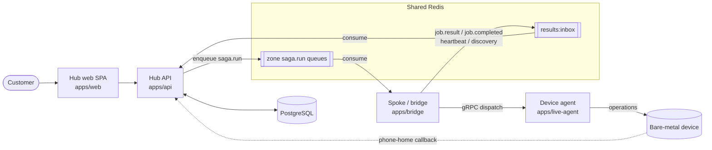
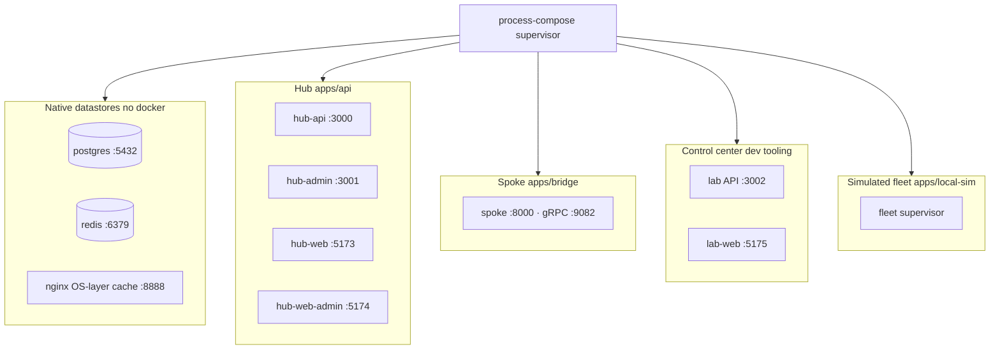
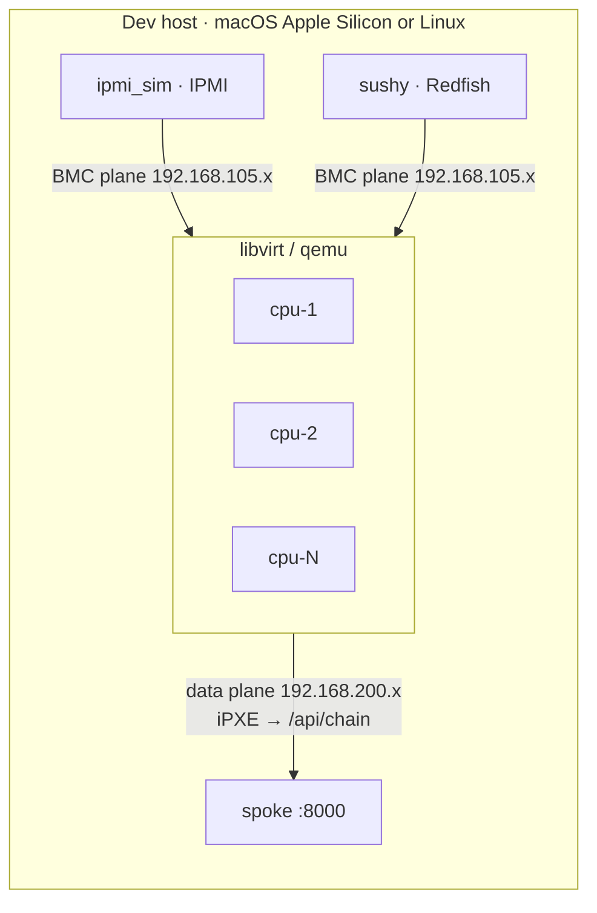
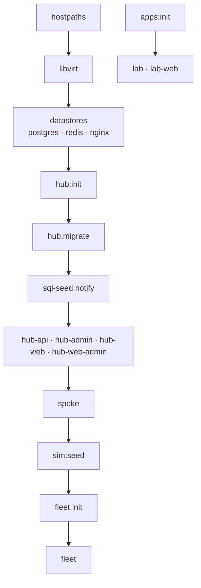

# Brokkr Architecture

Two views of the system:

1. **[Product architecture](#product-architecture)** — how the shipped pieces (hub, spoke,
   device agent) talk to each other in production.
2. **[Local-dev architecture](#local-dev-architecture)** — how the in-repo `devenv` stack
   and the simulated fleet reproduce that topology on one machine, no hardware required.

For the getting-started walkthrough see the root [`README.md`](../README.md); for the
local-dev operator reference see [`devenv/README.md`](../devenv/README.md); for the database
schema see [`packages/database/SCHEMA_DIAGRAM.md`](../packages/database/SCHEMA_DIAGRAM.md).

---

## Product architecture

_hub · spoke · agent_

Brokkr is **hub-and-spoke**:

- **Hub** (`apps/api`) — the customer-facing NestJS backend + React SPA. Owns the database,
  auth, billing, and the provisioning sagas. Enqueues work to zones over **BullMQ** (shared
  Redis).
- **Spoke / bridge** (`apps/bridge`) — a NestJS (Fastify) gateway that runs in each zone,
  consumes `saga.run` jobs from the hub, and dispatches named operations to devices over
  **gRPC**. A line-for-line TypeScript port of the legacy Python `bridge-api`.
- **Device agent** (`apps/live-agent`, package `bridge-agent`) — runs on each device, holds a
  persistent gRPC session to its zone's bridges, and executes operations.
- **Shared protocol** (`packages/bridge-agent-protocol`) — the Zod schemas for every
  bridge↔agent operation; the single source of truth for request/response shapes.

Results flow hub-ward through a shared `results:inbox` queue. A device reaches `provisioned`
only via the **phone-home callback** after its new OS boots — not from a successful saga.

---

## Local-dev architecture

_devenv · process-compose_

The whole stack is **declarative**: `devenv.nix` + `devenv/modules/*.nix` describe the
toolchain, the native datastores, and every process. **devenv** evaluates that and hands it to
**process-compose**, which supervises everything over a Unix-domain socket (`task logs`
attaches to it). There is **no Docker for the datastores** — Postgres, Redis, and the
nginx OS-layer cache run as native `services.*`.

One command — `task up` — brings it all up: the hub, the spoke, the control center
(`apps/local-lab` + `apps/local-lab-web`), and a simulated device fleet.

### Simulated fleet

The fleet is a set of **libvirt/qemu** guests, each with its own simulated BMC — OpenIPMI
`ipmi_sim` (IPMI) and `sushy` (Redfish) — so the full provision → power-cycle → reprovision →
deprovision lifecycle runs against virtual hardware. Two host-routable network planes:

- **BMC plane** (default `192.168.105.0/24`) — loopback alias IPs where ipmi_sim + sushy bind.
- **Data plane** (default `192.168.200.0/24`) — host-routable bridge; each VM's NIC gets a
  static IP. The spoke serves boot artifacts here.

Each VM direct-loads a per-VM **iPXE** binary as its kernel; iPXE chains to the spoke's
`/api/chain`, which decides discovery-OS vs. boot-from-disk from the device's hub state. For
the deep engine internals (boot path, seed pipeline, gotchas) see
[`apps/local-sim/ARCHITECTURE.md`](../apps/local-sim/ARCHITECTURE.md).

### Bring-up DAG

`task up` is a thin idempotent wrapper: it runs the host bootstrap once, installs the scoped
sudo drop-in, then `devenv up -d` brings up the **DAG** (each step waits on its dependencies'
readiness probes). Re-running `task up` reconciles a wedged stack from the terminal; the control
center drives the same cycle from the browser with **Reinit** (wipe datastore data + rebuild),
**Reset** (also wipes fleet overlays) and **Purge** (also wipes host-global caches). Those three
detach, so the recreation outlives the control-center API it restarts — the cockpit reports the
in-flight recreation and the per-task init state rather than degrading to empty panels.

`apps:init` sits off the chain because it declares no dependencies: the control center has to come up
even when the stack it manages does not, which is exactly when an operator needs it.

Every init task above is instrumented: it writes a log plus an exit-status sidecar, which is what
lets the Stack tab render the roster live (state, exit code, tailable log per task).

---

## See also

- [`README.md`](../README.md) — human onboarding + from-scratch getting started
- [`devenv/README.md`](../devenv/README.md) — local-dev operator reference (config, secrets,
  platform notes, troubleshooting)
- [`apps/local-sim/ARCHITECTURE.md`](../apps/local-sim/ARCHITECTURE.md) — simulator engine internals
- [`packages/database/SCHEMA_DIAGRAM.md`](../packages/database/SCHEMA_DIAGRAM.md) — database ER diagrams
