# Database Schema Diagram

> Auto-maintained by Claude Code. Update this file whenever Prisma schema models change.

## Core Device Model

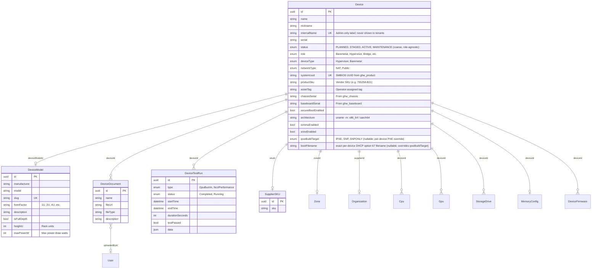
```mermaid
erDiagram
    Device {
        uuid id PK
        string name
        string nickname
        string internalName UK "Admin-only label; never shown to tenants"
        string serial
        enum status "PLANNED, STAGED, ACTIVE, MAINTENANCE (coarse, role-agnostic)"
        enum role "Baremetal, Hypervisor, Bridge, etc."
        enum deviceType "Hypervisor, Baremetal"
        enum networkType "NAT, Public"
        string systemUuid UK "SMBIOS UUID from ghw_product"
        string productSku "Vendor SKU (e.g. 755258-B21)"
        string assetTag "Operator-assigned tag"
        string chassisSerial "From ghw_chassis"
        string baseboardSerial "From ghw_baseboard"
        bool secureBootEnabled
        string architecture "uname -m: x86_64 / aarch64"
        bool iommuEnabled
        bool sriovEnabled
        enum ipxeBuildTarget "IPXE, SNP, SNPONLY (nullable; per-device PXE override)"
        string bootFilename "exact per-device DHCP option 67 filename (nullable; overrides ipxeBuildTarget)"
    }

    DeviceModel {
        uuid id PK
        string manufacturer
        string model
        string slug UK
        string formFactor "1U, 2U, 4U, etc."
        string description
        bool isFullDepth
        int heightU "Rack units"
        int maxPowerW "Max power draw watts"
    }

    DeviceDocument {
        uuid id PK
        string name
        string fileUrl
        string fileType
        string description
    }

    DeviceTestRun {
        uuid id PK
        enum type "GpuBurnIn, NcclPerformance"
        enum status "Completed, Running"
        datetime startTime
        datetime endTime
        int durationSeconds
        bool testPassed
        json data
    }

    SupplierSKU {
        uuid id PK
        string sku
    }

    Device ||--o| DeviceModel : "deviceModelId"
    Device ||--o| Zone : "zoneId"
    Device ||--o| Organization : "supplierId"
    Device ||--o| SupplierSKU : "skuId"
    Device ||--o{ DeviceDocument : "deviceId"
    Device ||--o{ DeviceTestRun : "deviceId"
    Device ||--o{ Cpu : "deviceId"
    Device ||--o{ Gpu : "deviceId"
    Device ||--o{ StorageDrive : "deviceId"
    Device ||--o| MemoryConfig : "deviceId"
    Device ||--o{ DeviceFirmware : "deviceId"
    DeviceDocument }o--o| User : "uploadedById"
```

## Multi-Table Inheritance Extensions (Device)

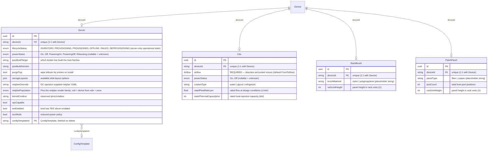
```mermaid
erDiagram
    Server {
        uuid id PK
        string deviceId FK "unique (1:1 with Device)"
        enum lifecycleStatus "INVENTORY, PROVISIONING, PROVISIONED, OFFLINE, FAILED, DEPROVISIONING (server-only operational state)"
        enum powerStatus "On, Off, PoweringOn, PoweringOff, Rebooting (nullable = unknown)"
        string ipxeBuildTarget "which brokkr-live build the host fetches"
        string ipxeBuildVersion
        bool purgeTtys "wipe leftover tty entries on install"
        json storageLayouts "available disk-layout options"
        string netplanOverride "DC operator-supplied netplan YAML"
        enum netplanPopulation "Pins the netplan render family; null = derive from role + zone"
        string kernelCmdline "observed /proc/cmdline"
        bool vpcCapable
        bool teeEnabled "host has TEE silicon enabled"
        bool ecoMode "reduced-power policy"
        string configTemplateId FK "ConfigTemplate, SetNull on delete"
    }

    Cdu {
        uuid id PK
        string deviceId FK "unique (1:1 with Device)"
        Airflow airflow "REQUIRED — direction air/coolant moves (default FrontToRear)"
        enum powerStatus "On, Off (nullable = unknown)"
        string coolantType "water | glycol | refrigerant"
        float ratedFlowRateLpm "rated flow at design conditions (L/min)"
        int ratedThermalCapacityKw "rated heat-rejection capacity (kW)"
    }

    RackBrush {
        uuid id PK
        string deviceId FK "unique (1:1 with Device)"
        string brushMaterial "nylon | polypropylene (placeholder string)"
        int rackUnitHeight "panel height in rack units (U)"
    }

    PatchPanel {
        uuid id PK
        string deviceId FK "unique (1:1 with Device)"
        string panelType "fiber | copper (placeholder string)"
        int portCount "total front-port positions"
        int rackUnitHeight "panel height in rack units (U)"
    }

    Device ||--o| Server : "deviceId"
    Server }o--o| ConfigTemplate : "configTemplateId"
    Device ||--o| Cdu : "deviceId"
    Device ||--o| RackBrush : "deviceId"
    Device ||--o| PatchPanel : "deviceId"
```

`Server` is the Device extension for `Device.role = 'Server'` — the compute hosts Brokkr rents to customers. Per-rental customer choices (selected OS, layers, cloud-init blocks, VPC IPs) live on `Deployment`. Other `DeviceRole` values (Bridge, Switch, Router, PDU, CDU, RackBrush, PatchPanel) get their own extension tables and intentionally do NOT share this table.

`Cdu` is the extension for `Device.role = 'CDU'` — coolant distribution units feeding liquid-cooled racks. Its `airflow` column is a required `Airflow` enum (`FrontToRear | RearToFront | LeftToRight | RightToLeft | SideToRear | Passive | Mixed`, mirroring NetBox's native device airflow choices); it is NOT NULL with a `FrontToRear` default so machine-generated rows (the device-extension backfill) stay valid, while operator-facing create flows force an explicit choice.

`RackBrush` is the extension for `Device.role = 'RackBrush'` — rack-mounted brush panels for cable pass-through. Passive hardware: no power status, no BMC, no network presence.

`PatchPanel` is the extension for `Device.role = 'PatchPanel'` — rack-mounted patch panels terminating structured cabling. Passive hardware like RackBrush (no power status, no BMC, no network presence). Individual port positions are the role-agnostic `FrontPort`/`RearPort` rows.

**Observed power status (per-role).** Every powered role extension (`Server`, `Bridge`, `Switch`, `Router`, `Pdu`, `Cdu`) carries its own nullable `powerStatus` enum — "is the box powered on right now", distinct from `Device.status` and `Server.lifecycleStatus`. `Server.powerStatus` (`ServerPowerStatus`) has five values (`On | Off | PoweringOn | PoweringOff | Rebooting`) to track in-flight power operations the bridge power-control saga drives; the other five roles (`BridgePowerStatus`, `SwitchPowerStatus`, `RouterPowerStatus`, `PduPowerStatus`, `CduPowerStatus`) are `On | Off` only. All are nullable — `NULL` means the power state has never been observed. (The legacy free-form `Device.powerStatus` String has been removed; all readers source from these role fields, mapping to the legacy display vocabulary at the consumer/NetBox boundary via `serverPowerStatusToLegacy`.)

## Hardware Components

```mermaid
erDiagram
    Cpu {
        uuid id PK
        int socketIndex "0, 1, ..."
        string model "Intel Xeon Gold 6548Y+"
        string vendor "GenuineIntel, AuthenticAMD"
        string architecture "x86_64, aarch64"
        int coreCount "per-socket cores"
        int threadCount "per-socket threads"
        string_array capabilities "CPU flags from ghw_cpu"
    }

    Gpu {
        uuid id PK
        int index "0-7 slot index"
        string model "NVIDIA H100 80GB HBM3"
        enum vendor "NVIDIA, AMD, INTEL"
        string uuid "GPU UUID from nvidia-smi"
        string vbiosVersion
        string serial
        string pciBusId
        int memoryTotalMb "VRAM in MiB"
        bool eccEnabled
        int pcieLinkGen "4, 5"
        int pcieLinkWidth "16"
        decimal powerLimitW
        decimal powerLimitMaxW
        string driverVersion "Per-GPU driver"
        string computeCapability "8.0, 9.0"
        string architecture "Hopper, Ada, Ampere"
        bool migMode
        string migProfile
        enum ccMode "OFF, ON, DEVTOOLS (NVIDIA CC)"
    }

    StorageDrive {
        uuid id PK
        string name "nvme3n1, sda"
        enum type "NVME, SSD, HDD"
        string model "SAMSUNG MZQL2..."
        string serial
        string wwn "World Wide Name"
        bigint sizeBytes "Raw bytes"
        int physicalBlockBytes "4Kn vs 512e"
        string busPath "PCI path for NVMe"
        string storageController "NVMe, SATA, SAS, virtio"
    }

    MemoryConfig {
        uuid id PK
        int totalSizeMb
        int populatedDimms
        int totalSlots
        int dimmSizeMb "Null if mixed"
        enum dimmType "DDR3, DDR4, DDR5, LPDDR4, LPDDR5"
        string dimmSpeed "5600 MT/s"
        string configuredSpeed
        enum eccType "SINGLE_BIT_ECC, MULTI_BIT_ECC, NONE"
        string configSummary "32x64GB DDR5 5600 MT/s"
    }

    DeviceFirmware {
        uuid id PK
        enum type "BIOS, BMC, CPLD, GPU_DRIVER, NIC_FW, BMC_FW_BUILD"
        string vendor
        string version
        string date
    }

    PciDevice {
        uuid id PK
        string address "BDF e.g. 0000:01:00.0"
        string vendorId "hex"
        string vendorName
        string productId
        string productName
        string className
        string subclassName
        string driver "kernel driver bound"
        string subsystemVendorId
        string subsystemProductId
    }

    UefiBootEntry {
        uuid id PK
        string bootOptionReference "Boot#### ref"
        string displayName
        string uefiDevicePath
        bool enabled
        int bootOrderIndex
        bool isCurrent "matches BootCurrent"
    }

    NvlinkEdge {
        uuid id PK
        int sourceGpuIndex
        int targetGpuIndex
        int lanes
        decimal bandwidthGbps
        string linkStatus
    }

    DeviceSolConfig {
        string deviceId PK
        bool solCapable
        bool solEnabled
        int hardwareChannel
        int baudRate
        int port
        bool encryptionCapable
        string optimalPort "e.g. ttyS1"
        string bmcChannelMapping
        string resolvedPort "in-band probed console port"
        int resolvedBaud
        string resolvedSource "probed|modem_hint|vendor_table|none"
        bool resolvedConfirmed
        string_array availablePorts
    }

    Device ||--o{ Cpu : "deviceId"
    Device ||--o{ Gpu : "deviceId"
    Device ||--o{ StorageDrive : "deviceId"
    Device ||--o| MemoryConfig : "deviceId"
    Device ||--o{ DeviceFirmware : "deviceId"
    Device ||--o{ PciDevice : "deviceId"
    Device ||--o{ UefiBootEntry : "deviceId"
    Device ||--o{ NvlinkEdge : "deviceId"
    Device ||--o| DeviceSolConfig : "deviceId"
```

## Discovery Pipeline

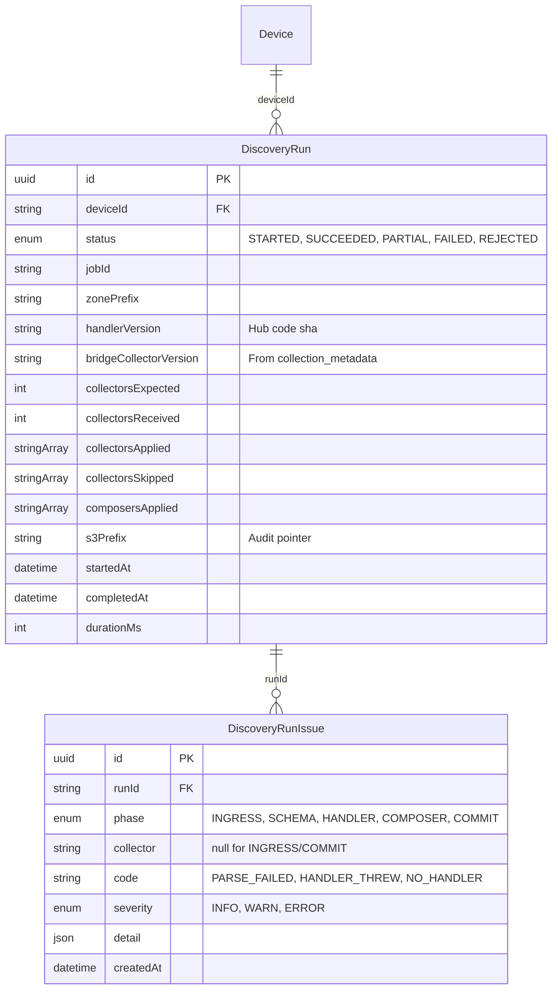
```mermaid
erDiagram
    DiscoveryRun {
        uuid id PK
        string deviceId FK
        enum status "STARTED, SUCCEEDED, PARTIAL, FAILED, REJECTED"
        string jobId
        string zonePrefix
        string handlerVersion "Hub code sha"
        string bridgeCollectorVersion "From collection_metadata"
        int collectorsExpected
        int collectorsReceived
        stringArray collectorsApplied
        stringArray collectorsSkipped
        stringArray composersApplied
        string s3Prefix "Audit pointer"
        datetime startedAt
        datetime completedAt
        int durationMs
    }

    DiscoveryRunIssue {
        uuid id PK
        string runId FK
        enum phase "INGRESS, SCHEMA, HANDLER, COMPOSER, COMMIT"
        string collector "null for INGRESS/COMMIT"
        string code "PARSE_FAILED, HANDLER_THREW, NO_HANDLER"
        enum severity "INFO, WARN, ERROR"
        json detail
        datetime createdAt
    }

    Device ||--o{ DiscoveryRun : "deviceId"
    DiscoveryRun ||--o{ DiscoveryRunIssue : "runId"
```

## Networking — Interfaces & IP Addresses

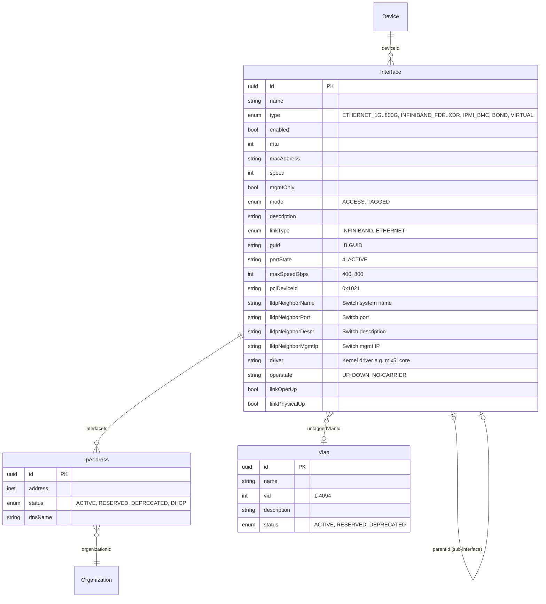
```mermaid
erDiagram
    Interface {
        uuid id PK
        string name
        enum type "ETHERNET_1G..800G, INFINIBAND_FDR..XDR, IPMI_BMC, BOND, VIRTUAL"
        bool enabled
        int mtu
        string macAddress
        int speed
        bool mgmtOnly
        enum mode "ACCESS, TAGGED"
        string description
        enum linkType "INFINIBAND, ETHERNET"
        string guid "IB GUID"
        string portState "4: ACTIVE"
        int maxSpeedGbps "400, 800"
        string pciDeviceId "0x1021"
        string lldpNeighborName "Switch system name"
        string lldpNeighborPort "Switch port"
        string lldpNeighborDescr "Switch description"
        string lldpNeighborMgmtIp "Switch mgmt IP"
        string driver "Kernel driver e.g. mlx5_core"
        string operstate "UP, DOWN, NO-CARRIER"
        bool linkOperUp
        bool linkPhysicalUp
    }

    IpAddress {
        uuid id PK
        inet address
        enum status "ACTIVE, RESERVED, DEPRECATED, DHCP"
        string dnsName
    }

    Vlan {
        uuid id PK
        string name
        int vid "1-4094"
        string description
        enum status "ACTIVE, RESERVED, DEPRECATED"
    }

    Device ||--o{ Interface : "deviceId"
    Interface ||--o{ IpAddress : "interfaceId"
    Interface |o--o| Interface : "lagId (bond parent)"
    Interface |o--o| Interface : "parentId (sub-interface)"
    Interface }o--o| Vlan : "untaggedVlanId"
    IpAddress }o--|| Organization : "organizationId"
```

Unique constraints on `Interface` (partial, active rows only — `WHERE "deletedAt" IS NULL`): `(deviceId, name)`, and `(deviceId, lower(macAddress))` where `macAddress IS NOT NULL`. Both are raw-SQL indexes Prisma cannot express, so the model carries no `@@unique`; `InterfaceRecord` pre-checks them for a readable 409.

## IPAM — Prefixes, VLANs, VRFs, Ranges

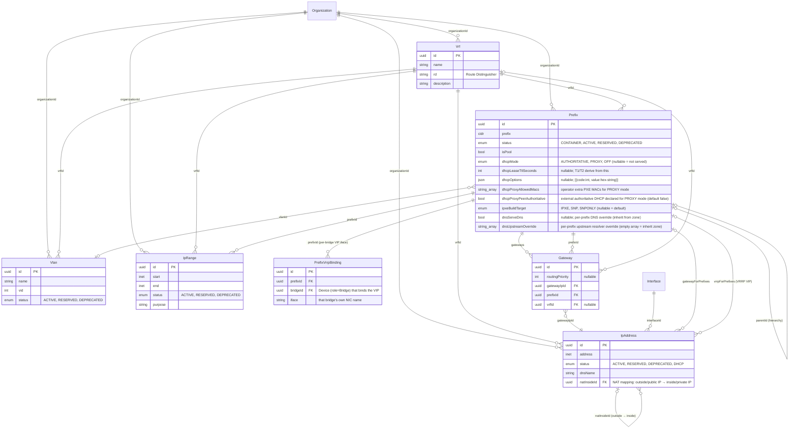
```mermaid
erDiagram
    Vrf {
        uuid id PK
        string name
        string rd "Route Distinguisher"
        string description
    }

    Prefix {
        uuid id PK
        cidr prefix
        enum status "CONTAINER, ACTIVE, RESERVED, DEPRECATED"
        bool isPool
        enum dhcpMode "AUTHORITATIVE, PROXY, OFF (nullable = not served)"
        int dhcpLeaseTtlSeconds "nullable; T1/T2 derive from this"
        json dhcpOptions "nullable; [{code:int, value:hex-string}]"
        string_array dhcpProxyAllowedMacs "operator extra PXE MACs for PROXY mode"
        bool dhcpProxyPeerAuthoritative "external authoritative DHCP declared for PROXY mode (default false)"
        enum ipxeBuildTarget "IPXE, SNP, SNPONLY (nullable = default)"
        bool dnsServeDns "nullable; per-prefix DNS override (inherit from zone)"
        string_array dnsUpstreamOverride "per-prefix upstream resolver override (empty array = inherit zone)"
    }

    Vlan {
        uuid id PK
        string name
        int vid
        enum status "ACTIVE, RESERVED, DEPRECATED"
    }

    IpAddress {
        uuid id PK
        inet address
        enum status "ACTIVE, RESERVED, DEPRECATED, DHCP"
        string dnsName
        uuid natInsideId FK "NAT mapping: outside/public IP → inside/private IP"
    }

    IpRange {
        uuid id PK
        inet start
        inet end
        enum status "ACTIVE, RESERVED, DEPRECATED"
        string purpose
    }

    PrefixVrrpBinding {
        uuid id PK
        uuid prefixId FK
        uuid bridgeId FK "Device (role=Bridge) that binds the VIP"
        string iface "that bridge's own NIC name"
    }

    Gateway {
        uuid id PK
        int routingPriority "nullable"
        uuid gatewayIpId FK
        uuid prefixId FK
        uuid vrfId FK "nullable"
    }

    Organization ||--o{ Vrf : "organizationId"
    Organization ||--o{ Prefix : "organizationId"
    Organization ||--o{ IpAddress : "organizationId"
    Organization ||--o{ Vlan : "organizationId"
    Organization ||--o{ IpRange : "organizationId"
    Vrf ||--o{ Prefix : "vrfId"
    Vrf ||--o{ Vlan : "vrfId"
    Vrf ||--o{ IpAddress : "vrfId"
    Vrf ||--o{ IpRange : "vrfId"
    Prefix |o--o| Prefix : "parentId (hierarchy)"
    Prefix }o--o| Vlan : "vlanId"
    Prefix ||--o{ IpRange : "prefixId"
    IpAddress }o--o| Prefix : "gatewayForPrefixes"
    IpAddress }o--o| Prefix : "vrrpForPrefixes (VRRP VIP)"
    Prefix ||--o{ PrefixVrrpBinding : "prefixId (per-bridge VIP iface)"
    Gateway }o--|| IpAddress : "gatewayIpId"
    Gateway }o--|| Prefix : "prefixId"
    Gateway }o--o| Vrf : "vrfId"
    Prefix ||--o{ Gateway : "gateways"
    Interface ||--o{ IpAddress : "interfaceId"
    IpAddress |o--o{ IpAddress : "natInsideId (outside → inside)"
```

## DNS — Domains & Records

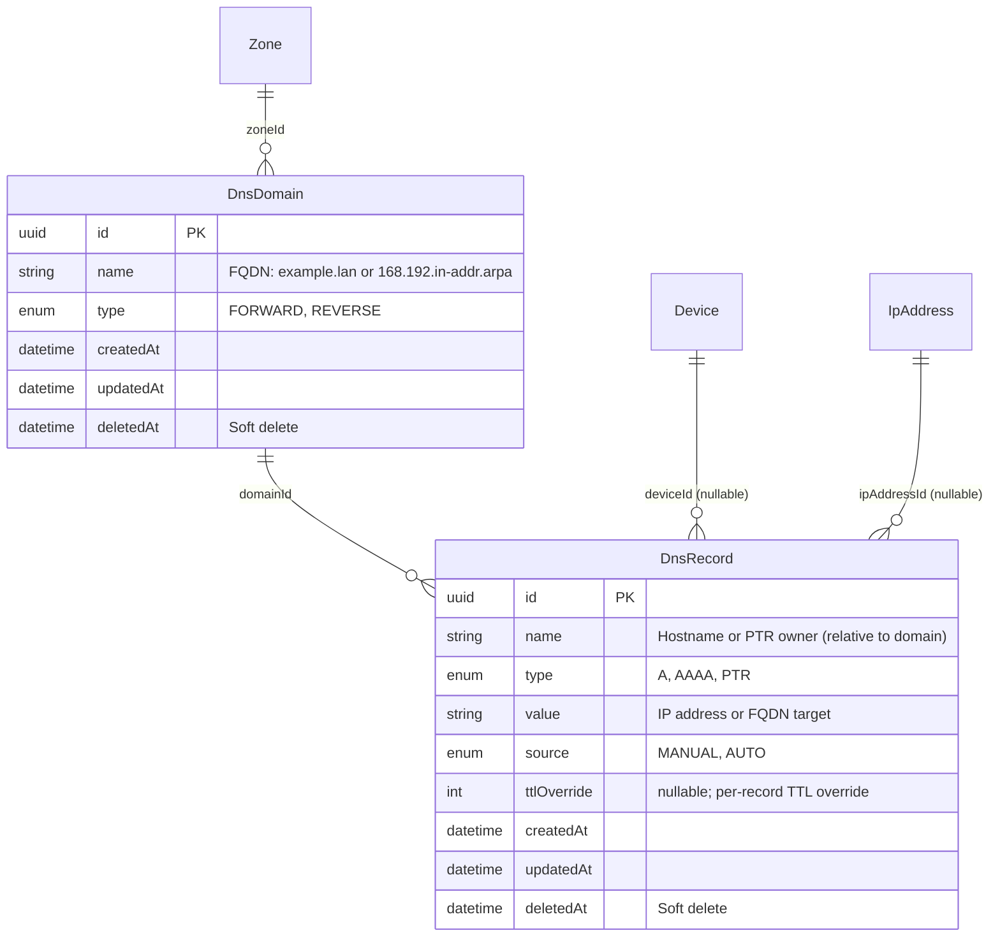
```mermaid
erDiagram
    DnsDomain {
        uuid id PK
        string name "FQDN: example.lan or 168.192.in-addr.arpa"
        enum type "FORWARD, REVERSE"
        datetime createdAt
        datetime updatedAt
        datetime deletedAt "Soft delete"
    }

    DnsRecord {
        uuid id PK
        string name "Hostname or PTR owner (relative to domain)"
        enum type "A, AAAA, PTR"
        string value "IP address or FQDN target"
        enum source "MANUAL, AUTO"
        int ttlOverride "nullable; per-record TTL override"
        datetime createdAt
        datetime updatedAt
        datetime deletedAt "Soft delete"
    }

    Zone ||--o{ DnsDomain : "zoneId"
    DnsDomain ||--o{ DnsRecord : "domainId"
    Device ||--o{ DnsRecord : "deviceId (nullable)"
    IpAddress ||--o{ DnsRecord : "ipAddressId (nullable)"
```

Unique constraints (partial, active rows only — `WHERE "deletedAt" IS NULL`): `(zoneId, name)` on `DnsDomain`; `(domainId, name, type, value)` on `DnsRecord`. The `Device` and `IpAddress` relations on `DnsRecord` are optional — `MANUAL` records may omit them; `AUTO` records link back to the IPAM source that generated them.

## Organization & Zones

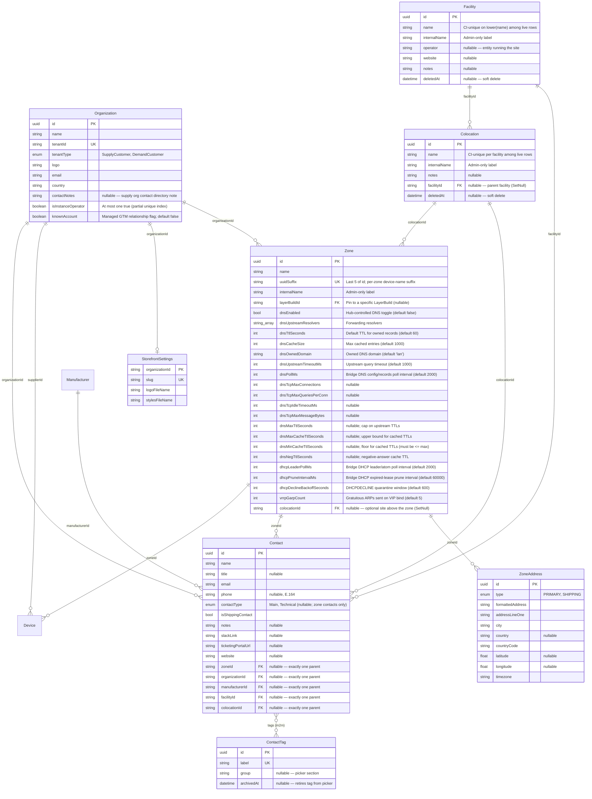
```mermaid
erDiagram
    Organization {
        uuid id PK
        string name
        string tenantId UK
        enum tenantType "SupplyCustomer, DemandCustomer"
        string logo
        string email
        string country
        string contactNotes "nullable — supply org contact directory note"
        boolean isInstanceOperator "At most one true (partial unique index)"
        boolean knownAccount "Managed GTM relationship flag; default false"
    }

    Zone {
        uuid id PK
        string name
        string uuidSuffix UK "Last 5 of id; per-zone device-name suffix"
        string internalName "Admin-only label"
        string layerBuildId FK "Pin to a specific LayerBuild (nullable)"
        bool dnsEnabled "Hub-controlled DNS toggle (default false)"
        string_array dnsUpstreamResolvers "Forwarding resolvers"
        int dnsTtlSeconds "Default TTL for owned records (default 60)"
        int dnsCacheSize "Max cached entries (default 1000)"
        string dnsOwnedDomain "Owned DNS domain (default 'lan')"
        int dnsUpstreamTimeoutMs "Upstream query timeout (default 1000)"
        int dnsPollMs "Bridge DNS config/records poll interval (default 2000)"
        int dnsTcpMaxConnections "nullable"
        int dnsTcpMaxQueriesPerConn "nullable"
        int dnsTcpIdleTimeoutMs "nullable"
        int dnsTcpMaxMessageBytes "nullable"
        int dnsMaxTtlSeconds "nullable; cap on upstream TTLs"
        int dnsMaxCacheTtlSeconds "nullable; upper bound for cached TTLs"
        int dnsMinCacheTtlSeconds "nullable; floor for cached TTLs (must be <= max)"
        int dnsNegTtlSeconds "nullable; negative-answer cache TTL"
        int dhcpLeaderPollMs "Bridge DHCP leader/atom poll interval (default 2000)"
        int dhcpPruneIntervalMs "Bridge DHCP expired-lease prune interval (default 60000)"
        int dhcpDeclineBackoffSeconds "DHCPDECLINE quarantine window (default 600)"
        int vrrpGarpCount "Gratuitous ARPs sent on VIP bind (default 5)"
        string colocationId FK "nullable — optional site above the zone (SetNull)"
    }

    Facility {
        uuid id PK
        string name "CI-unique on lower(name) among live rows"
        string internalName "Admin-only label"
        string operator "nullable — entity running the site"
        string website "nullable"
        string notes "nullable"
        datetime deletedAt "nullable — soft delete"
    }

    Colocation {
        uuid id PK
        string name "CI-unique per facility among live rows"
        string internalName "Admin-only label"
        string notes "nullable"
        string facilityId FK "nullable — parent facility (SetNull)"
        datetime deletedAt "nullable — soft delete"
    }

    ZoneAddress {
        uuid id PK
        enum type "PRIMARY, SHIPPING"
        string formattedAddress
        string addressLineOne
        string city
        string country "nullable"
        string countryCode
        float latitude "nullable"
        float longitude "nullable"
        string timezone
    }

    Contact {
        uuid id PK
        string name
        string title "nullable"
        string email
        string phone "nullable, E.164"
        enum contactType "Main, Technical (nullable; zone contacts only)"
        bool isShippingContact
        string notes "nullable"
        string slackLink "nullable"
        string ticketingPortalUrl "nullable"
        string website "nullable"
        string zoneId FK "nullable — exactly one parent"
        string organizationId FK "nullable — exactly one parent"
        string manufacturerId FK "nullable — exactly one parent"
        string facilityId FK "nullable — exactly one parent"
        string colocationId FK "nullable — exactly one parent"
    }

    ContactTag {
        uuid id PK
        string label UK
        string group "nullable — picker section"
        datetime archivedAt "nullable — retires tag from picker"
    }

    StorefrontSettings {
        string organizationId PK
        string slug UK
        string logoFileName
        string stylesFileName
    }

    Organization ||--o{ Zone : "organizationId"
    Organization ||--o| StorefrontSettings : "organizationId"
    Organization ||--o{ Device : "supplierId"
    Zone ||--o{ ZoneAddress : "zoneId"
    Zone ||--o{ Contact : "zoneId"
    Organization ||--o{ Contact : "organizationId"
    Manufacturer ||--o{ Contact : "manufacturerId"
    Facility ||--o{ Contact : "facilityId"
    Colocation ||--o{ Contact : "colocationId"
    Facility ||--o{ Colocation : "facilityId"
    Colocation ||--o{ Zone : "colocationId"
    Contact }o--o{ ContactTag : "tags (m2m)"
    Zone ||--o{ Device : "zoneId"
```

`Contact` carries exactly one parent, enforced by the raw `Contact_exactly_one_parent`
CHECK over all five FK columns (Prisma cannot express a cross-column CHECK).

`Facility -> Colocation -> Zone` is the optional operator hierarchy: it exists so the
people who run a site (NOC, upstream, integrator, procurement) are recorded once per
facility or colocation instead of copied onto every zone. Every link is nullable — a
zone with no colocation behaves exactly as before — and geography stays on
`ZoneAddress`; neither new entity carries an address.

## Membership & RBAC

Authorization derives from `Member.assignedRoleId` → `OrganizationMemberRole`
permission sets. Ordinary management uses strict set dominance; owner
capability requires the complete application catalog. The legacy `Member.role`
enum is compatibility-only, retained until its removal; nothing should read it
for authorization.

Invitations use the required `assignedRoleId` relation as their only persisted
role source. API responses derive the display name from `OrganizationMemberRole`.
Member and invitation role foreign keys both use `ON DELETE RESTRICT`. Custom
roles are archived with `archivedAt`; archived slugs remain reserved and
historical joins continue to resolve the role name.

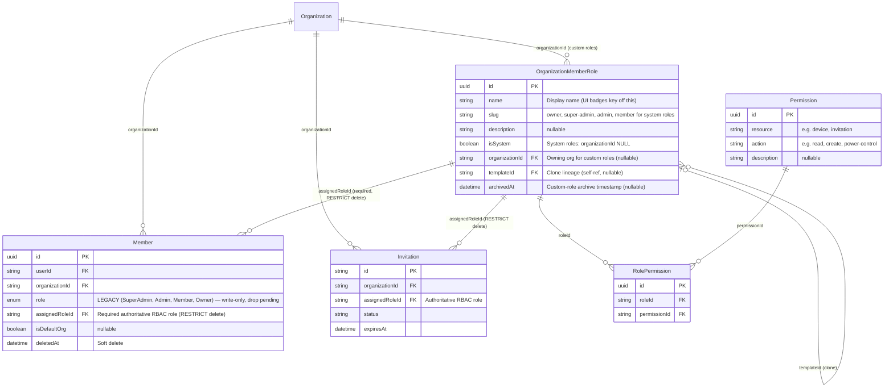
```mermaid
erDiagram
    Member {
        uuid id PK
        string userId FK
        string organizationId FK
        enum role "LEGACY (SuperAdmin, Admin, Member, Owner) — write-only, drop pending"
        string assignedRoleId FK "Required authoritative RBAC role (RESTRICT delete)"
        boolean isDefaultOrg "nullable"
        datetime deletedAt "Soft delete"
    }

    Invitation {
        string id PK
        string organizationId FK
        string assignedRoleId FK "Authoritative RBAC role"
        string status
        datetime expiresAt
    }

    OrganizationMemberRole {
        uuid id PK
        string name "Display name (UI badges key off this)"
        string slug "owner, super-admin, admin, member for system roles"
        string description "nullable"
        boolean isSystem "System roles: organizationId NULL"
        string organizationId FK "Owning org for custom roles (nullable)"
        string templateId FK "Clone lineage (self-ref, nullable)"
        datetime archivedAt "Custom-role archive timestamp (nullable)"
    }

    Permission {
        uuid id PK
        string resource "e.g. device, invitation"
        string action "e.g. read, create, power-control"
        string description "nullable"
    }

    RolePermission {
        uuid id PK
        string roleId FK
        string permissionId FK
    }

    Organization ||--o{ Member : "organizationId"
    Organization ||--o{ Invitation : "organizationId"
    Organization ||--o{ OrganizationMemberRole : "organizationId (custom roles)"
    OrganizationMemberRole ||--o{ Member : "assignedRoleId (required, RESTRICT delete)"
    OrganizationMemberRole ||--o{ Invitation : "assignedRoleId (RESTRICT delete)"
    OrganizationMemberRole |o--o{ OrganizationMemberRole : "templateId (clone)"
    OrganizationMemberRole ||--o{ RolePermission : "roleId"
    Permission ||--o{ RolePermission : "permissionId"
```

## Organization Event Log

Tenant-facing record of actions taken within an organization. Deliberately has **no
foreign keys**: a row must outlive the user, device, or organization it describes, and
must show what was true at the time, so actor and target labels are denormalized.
`durability` records what was actually achieved for that row — only `ATOMIC` rows were
written inside their mutation's transaction and are therefore compliance-grade. A `MIRROR`
row projects an event whose preferred record lives in a purpose-built audit table
(`DeviceSecretAuditEvent`); neither row is guaranteed, so the absence of either is not
evidence the event did not happen.

`EventLogAccessBucket` exists solely to throttle "who viewed the log" entries: the
unique constraint is the throttle, since a read-then-write check races.

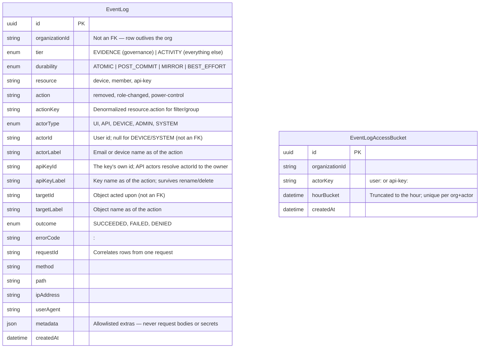
```mermaid
erDiagram
    EventLog {
        uuid id PK
        string organizationId "Not an FK — row outlives the org"
        enum tier "EVIDENCE (governance) | ACTIVITY (everything else)"
        enum durability "ATOMIC | POST_COMMIT | MIRROR | BEST_EFFORT"
        string resource "device, member, api-key"
        string action "removed, role-changed, power-control"
        string actionKey "Denormalized resource.action for filter/group"
        enum actorType "UI, API, DEVICE, ADMIN, SYSTEM"
        string actorId "User id; null for DEVICE/SYSTEM (not an FK)"
        string actorLabel "Email or device name as of the action"
        string apiKeyId "The key's own id; API actors resolve actorId to the owner"
        string apiKeyLabel "Key name as of the action; survives rename/delete"
        string targetId "Object acted upon (not an FK)"
        string targetLabel "Object name as of the action"
        enum outcome "SUCCEEDED, FAILED, DENIED"
        string errorCode "<mappedStatus>:<ExceptionClassName>"
        string requestId "Correlates rows from one request"
        string method
        string path
        string ipAddress
        string userAgent
        json metadata "Allowlisted extras — never request bodies or secrets"
        datetime createdAt
    }

    EventLogAccessBucket {
        uuid id PK
        string organizationId
        string actorKey "user:<userId> or api-key:<apiKeyId>"
        datetime hourBucket "Truncated to the hour; unique per org+actor"
        datetime createdAt
    }
```

## Tags (Generic)

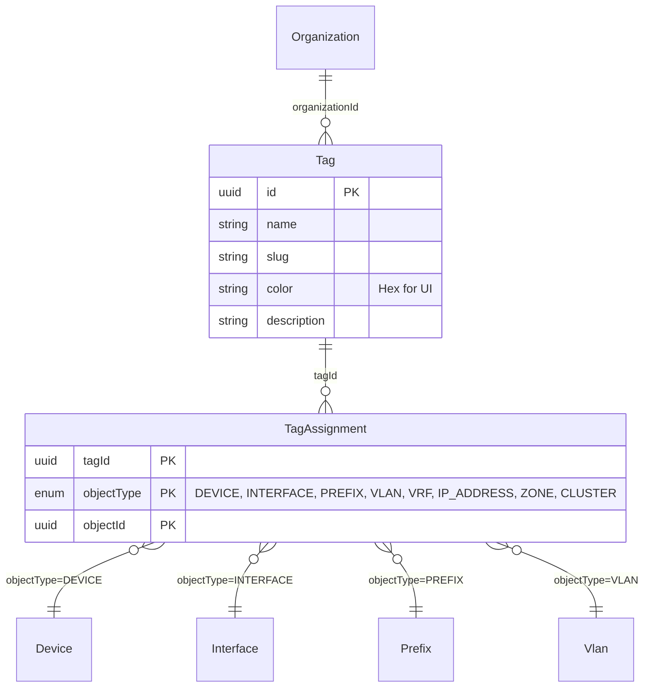
```mermaid
erDiagram
    Tag {
        uuid id PK
        string name
        string slug
        string color "Hex for UI"
        string description
    }

    TagAssignment {
        uuid tagId PK
        enum objectType PK "DEVICE, INTERFACE, PREFIX, VLAN, VRF, IP_ADDRESS, ZONE, CLUSTER"
        uuid objectId PK
    }

    Organization ||--o{ Tag : "organizationId"
    Tag ||--o{ TagAssignment : "tagId"
    TagAssignment }o--|| Device : "objectType=DEVICE"
    TagAssignment }o--|| Interface : "objectType=INTERFACE"
    TagAssignment }o--|| Prefix : "objectType=PREFIX"
    TagAssignment }o--|| Vlan : "objectType=VLAN"
```

## Reference Data

Brokkr-owned reference data, managed via admin CRUD. Brokkr is the source of truth; there is no external sync.

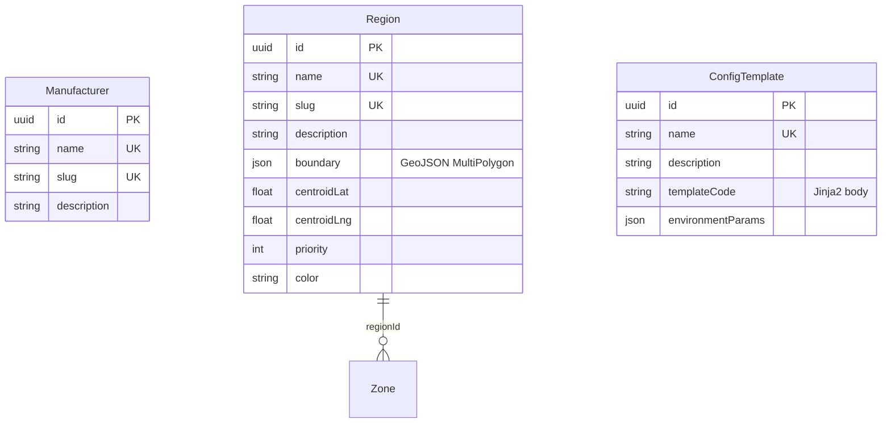
```mermaid
erDiagram
    Manufacturer {
        uuid id PK
        string name UK
        string slug UK
        string description
    }

    Region {
        uuid id PK
        string name UK
        string slug UK
        string description
        json boundary "GeoJSON MultiPolygon"
        float centroidLat
        float centroidLng
        int priority
        string color
    }

    ConfigTemplate {
        uuid id PK
        string name UK
        string description
        string templateCode "Jinja2 body"
        json environmentParams
    }

    Region ||--o{ Zone : "regionId"
```

**Relationships:**

- `Manufacturer` is referenced by name on `DeviceModel.manufacturer` (string field, not yet a FK).
- `Region.boundary`, centroid, and priority drive automatic geographic assignment.
- `Zone.regionId` is the FK from a zone to its region (optional).

## Circuits

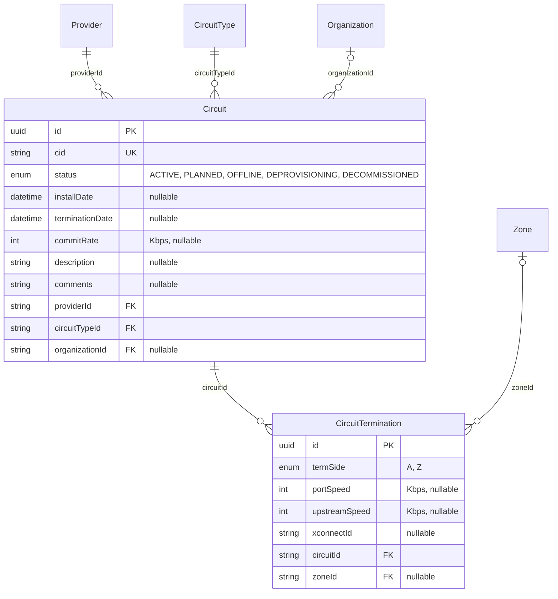
```mermaid
erDiagram
    Circuit {
        uuid id PK
        string cid UK
        enum status "ACTIVE, PLANNED, OFFLINE, DEPROVISIONING, DECOMMISSIONED"
        datetime installDate "nullable"
        datetime terminationDate "nullable"
        int commitRate "Kbps, nullable"
        string description "nullable"
        string comments "nullable"
        string providerId FK
        string circuitTypeId FK
        string organizationId FK "nullable"
    }

    CircuitTermination {
        uuid id PK
        enum termSide "A, Z"
        int portSpeed "Kbps, nullable"
        int upstreamSpeed "Kbps, nullable"
        string xconnectId "nullable"
        string circuitId FK
        string zoneId FK "nullable"
    }

    Provider ||--o{ Circuit : "providerId"
    CircuitType ||--o{ Circuit : "circuitTypeId"
    Organization |o--o{ Circuit : "organizationId"
    Circuit ||--o{ CircuitTermination : "circuitId"
    Zone |o--o{ CircuitTermination : "zoneId"
```

## Reservations & Deployments

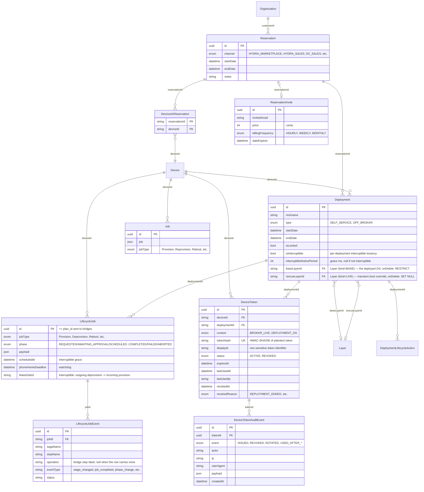
```mermaid
erDiagram
    Reservation {
        uuid id PK
        enum channel "HYDRA_MARKETPLACE, HYDRA_SALES, DC_SALES, etc."
        datetime startDate
        datetime endDate
        string notes
    }

    DevicesInReservation {
        string reservationId PK
        string deviceId PK
    }

    ReservationInvite {
        uuid id PK
        string inviteeEmail
        int price "cents"
        enum billingFrequency "HOURLY, WEEKLY, MONTHLY"
        datetime dateExpires
    }

    Deployment {
        uuid id PK
        string nickname
        enum type "SELF_SERVICE, OFF_BROKKR"
        datetime startDate
        datetime endDate
        bool isLocked
        bool isInterruptible "per-deployment interruptible tenancy"
        int interruptibleNoticePeriod "grace ms, null if not interruptible"
        string baseLayerId FK "Layer (kind=BASE) — the deployed OS; onDelete: RESTRICT"
        string rescueLayerId FK "Layer (kind=LIVE) — transient boot override; onDelete: SET NULL"
    }

    DeviceToken {
        uuid id PK
        string deviceId FK
        string deploymentId FK
        enum context "BROKKR_LIVE, DEPLOYMENT_OS"
        string tokenHash UK "HMAC-SHA256 of plaintext token"
        string displayId "non-sensitive token identifier"
        enum status "ACTIVE, REVOKED"
        datetime expiresAt
        datetime lastUsedAt
        string lastUsedIp
        datetime revokedAt
        enum revokedReason "DEPLOYMENT_ENDED, etc."
    }

    DeviceTokenAuditEvent {
        uuid id PK
        uuid tokenId FK
        enum event "ISSUED, REVOKED, ROTATED, USED_AFTER_*"
        string actor
        string ip
        string userAgent
        json payload
        datetime createdAt
    }

    Job {
        uuid id PK
        json job
        enum jobType "Provision, Reprovision, Reboot, etc."
    }

    LifecycleJob {
        uuid id PK "== plan_id sent to bridges"
        enum jobType "Provision, Deprovision, Reboot, etc."
        enum phase "REQUESTED/AWAITING_APPROVAL/SCHEDULED..COMPLETED/FAILED/ABORTED"
        json payload
        datetime scheduledAt "interruptible grace"
        datetime phoneHomeDeadline "watchdog"
        string linkedJobId "interruptible: outgoing deprovision -> incoming provision"
    }

    LifecycleJobEvent {
        uuid id PK
        string jobId FK
        string sagaName
        string stepName
        string operation "bridge step label; null when the row carries none"
        string eventType "stage_changed, job_completed, phase_change, etc."
        string status
    }

    Organization ||--o{ Reservation : "customerId"
    Reservation ||--o{ DevicesInReservation : "reservationId"
    DevicesInReservation }o--|| Device : "deviceId"
    Reservation ||--o{ Deployment : "reservationId"
    Reservation |o--o| ReservationInvite : "reservationId"
    Device ||--o{ Deployment : "deviceId"
    Deployment }o--o| Layer : "baseLayerId"
    Deployment }o--o| Layer : "rescueLayerId"
    Device ||--o{ Job : "deviceId"
    Device ||--o{ LifecycleJob : "deviceId"
    Deployment ||--o{ LifecycleJob : "deploymentId"
    LifecycleJob ||--o{ LifecycleJobEvent : "jobId"
    Deployment ||--o{ DeploymentLifecycleAction : "deploymentId"
    Device ||--o{ DeviceToken : "deviceId"
    Deployment ||--o{ DeviceToken : "deploymentId"
    DeviceToken ||--o{ DeviceTokenAuditEvent : "tokenId"
```

## Health Monitoring

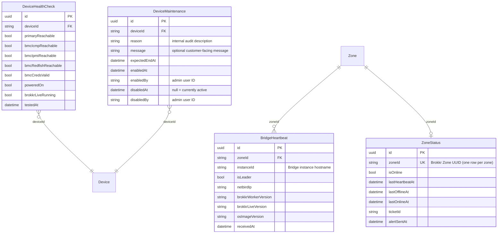
```mermaid
erDiagram
    BridgeHeartbeat {
        uuid id PK
        string zoneId FK
        string instanceId "Bridge instance hostname"
        bool isLeader
        string netbirdIp
        string brokkrWorkerVersion
        string brokkrLiveVersion
        string osImageVersion
        datetime receivedAt
    }

    DeviceHealthCheck {
        uuid id PK
        string deviceId FK
        bool primaryReachable
        bool bmcIcmpReachable
        bool bmcIpmiReachable
        bool bmcRedfishReachable
        bool bmcCredsValid
        bool poweredOn
        bool brokkrLiveRunning
        datetime testedAt
    }

    ZoneStatus {
        uuid id PK
        string zoneId UK "Brokkr Zone UUID (one row per zone)"
        bool isOnline
        datetime lastHeartbeatAt
        datetime lastOfflineAt
        datetime lastOnlineAt
        string ticketId
        datetime alertSentAt
    }

    DeviceMaintenance {
        uuid id PK
        string deviceId FK
        string reason "internal audit description"
        string message "optional customer-facing message"
        datetime expectedEndAt
        datetime enabledAt
        string enabledBy "admin user ID"
        datetime disabledAt "null = currently active"
        string disabledBy "admin user ID"
    }

    Zone ||--o{ BridgeHeartbeat : "zoneId"
    Zone ||--o| ZoneStatus : "zoneId"
    DeviceHealthCheck }o--|| Device : "deviceId"
    DeviceMaintenance }o--|| Device : "deviceId"
```

## Clusters (Vendor-Neutral East/West Networking)

Core owns the vendor-neutral cluster concept; the SDN implementation (Netris and
future Netris-like products) lives in a plugin, keyed by `provider`. The plugin
owns its vendor-specific state (e.g. Netris tenant/vpc/vnet ids) in its own
Postgres schema and links back via `providerClusterId` — there are no
cross-schema foreign keys.

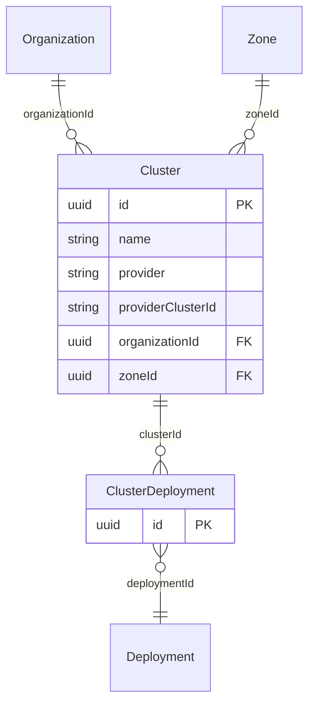
```mermaid
erDiagram
    Cluster {
        uuid id PK
        string name
        string provider
        string providerClusterId
        uuid organizationId FK
        uuid zoneId FK
    }

    ClusterDeployment {
        uuid id PK
    }

    Organization ||--o{ Cluster : "organizationId"
    Zone ||--o{ Cluster : "zoneId"
    Cluster ||--o{ ClusterDeployment : "clusterId"
    ClusterDeployment }o--|| Deployment : "deploymentId"
```

## Device Secrets (Zone-Sealed Credentials)

Append-only, per-device credential store. The hub seals each secret to
the destination zone's enrollment key and cannot open it — only that zone's bridge
can. Current version = MAX(version) WHERE invalidatedAt IS NULL per (deviceId, purpose);
a row sealed to a superseded keyGen is invalidated and never leaves the hub.

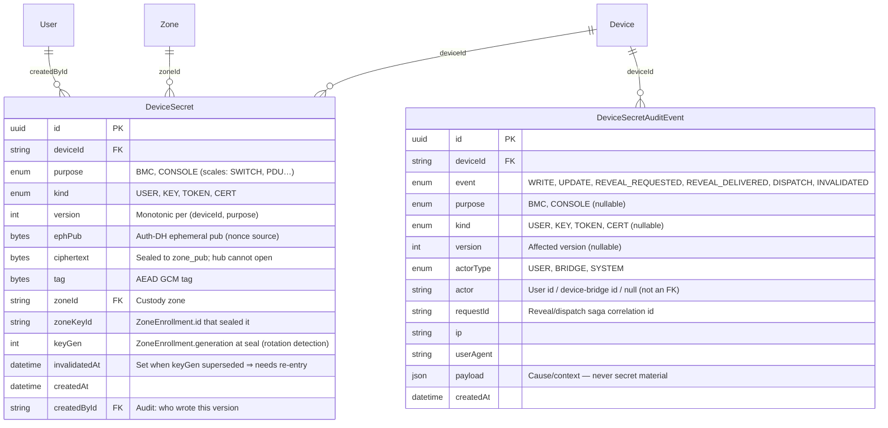
```mermaid
erDiagram
    DeviceSecret {
        uuid id PK
        string deviceId FK
        enum purpose "BMC, CONSOLE (scales: SWITCH, PDU…)"
        enum kind "USER, KEY, TOKEN, CERT"
        int version "Monotonic per (deviceId, purpose)"
        bytes ephPub "Auth-DH ephemeral pub (nonce source)"
        bytes ciphertext "Sealed to zone_pub; hub cannot open"
        bytes tag "AEAD GCM tag"
        string zoneId FK "Custody zone"
        string zoneKeyId "ZoneEnrollment.id that sealed it"
        int keyGen "ZoneEnrollment.generation at seal (rotation detection)"
        datetime invalidatedAt "Set when keyGen superseded ⇒ needs re-entry"
        datetime createdAt
        string createdById FK "Audit: who wrote this version"
    }

    DeviceSecretAuditEvent {
        uuid id PK
        string deviceId FK
        enum event "WRITE, UPDATE, REVEAL_REQUESTED, REVEAL_DELIVERED, DISPATCH, INVALIDATED"
        enum purpose "BMC, CONSOLE (nullable)"
        enum kind "USER, KEY, TOKEN, CERT (nullable)"
        int version "Affected version (nullable)"
        enum actorType "USER, BRIDGE, SYSTEM"
        string actor "User id / device-bridge id / null (not an FK)"
        string requestId "Reveal/dispatch saga correlation id"
        string ip
        string userAgent
        json payload "Cause/context — never secret material"
        datetime createdAt
    }

    Device ||--o{ DeviceSecret : "deviceId"
    Zone ||--o{ DeviceSecret : "zoneId"
    User ||--o{ DeviceSecret : "createdById"
    Device ||--o{ DeviceSecretAuditEvent : "deviceId"
```

## Layers & Artifacts (OS Customization)

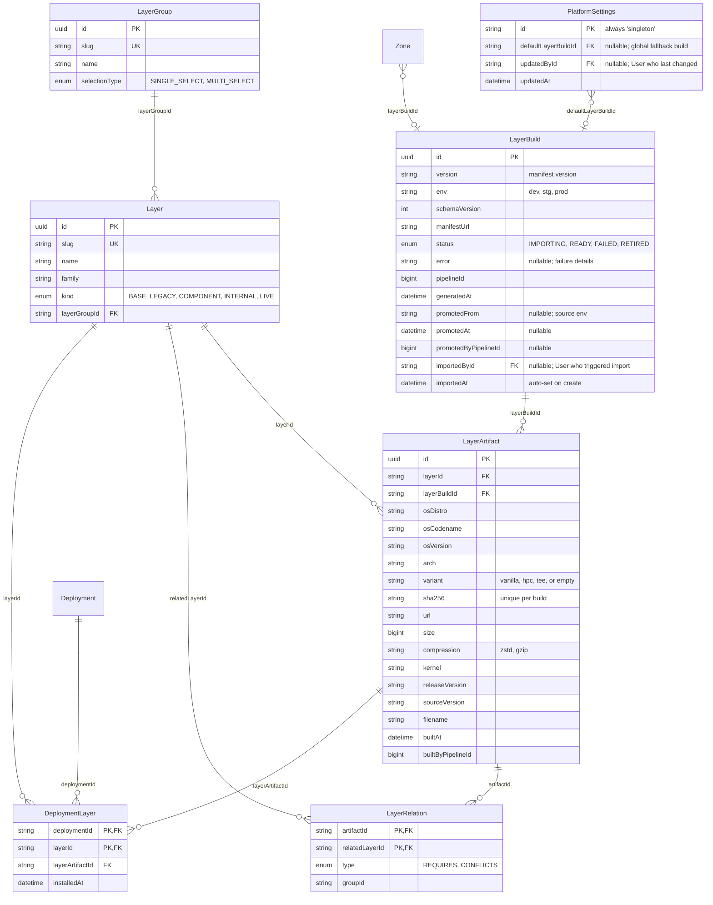
```mermaid
erDiagram
    LayerGroup {
        uuid id PK
        string slug UK
        string name
        enum selectionType "SINGLE_SELECT, MULTI_SELECT"
    }

    Layer {
        uuid id PK
        string slug UK
        string name
        string family
        enum kind "BASE, LEGACY, COMPONENT, INTERNAL, LIVE"
        string layerGroupId FK
    }

    LayerArtifact {
        uuid id PK
        string layerId FK
        string layerBuildId FK
        string osDistro
        string osCodename
        string osVersion
        string arch
        string variant "vanilla, hpc, tee, or empty"
        string sha256 "unique per build"
        string url
        bigint size
        string compression "zstd, gzip"
        string kernel
        string releaseVersion
        string sourceVersion
        string filename
        datetime builtAt
        bigint builtByPipelineId
    }

    LayerRelation {
        string artifactId PK,FK
        string relatedLayerId PK,FK
        enum type "REQUIRES, CONFLICTS"
        string groupId
    }

    DeploymentLayer {
        string deploymentId PK,FK
        string layerId PK,FK
        string layerArtifactId FK
        datetime installedAt
    }

    LayerBuild {
        uuid id PK
        string version "manifest version"
        string env "dev, stg, prod"
        int schemaVersion
        string manifestUrl
        enum status "IMPORTING, READY, FAILED, RETIRED"
        string error "nullable; failure details"
        bigint pipelineId
        datetime generatedAt
        string promotedFrom "nullable; source env"
        datetime promotedAt "nullable"
        bigint promotedByPipelineId "nullable"
        string importedById FK "nullable; User who triggered import"
        datetime importedAt "auto-set on create"
    }

    PlatformSettings {
        string id PK "always 'singleton'"
        string defaultLayerBuildId FK "nullable; global fallback build"
        string updatedById FK "nullable; User who last changed"
        datetime updatedAt
    }

    LayerGroup ||--o{ Layer : "layerGroupId"
    LayerBuild ||--o{ LayerArtifact : "layerBuildId"
    Layer ||--o{ LayerArtifact : "layerId"
    LayerArtifact ||--o{ LayerRelation : "artifactId"
    Layer ||--o{ LayerRelation : "relatedLayerId"
    Layer ||--o{ DeploymentLayer : "layerId"
    LayerArtifact ||--o{ DeploymentLayer : "layerArtifactId"
    Deployment ||--o{ DeploymentLayer : "deploymentId"
    PlatformSettings }o--o| LayerBuild : "defaultLayerBuildId"
    Zone }o--o| LayerBuild : "layerBuildId"
```

## BGP Routing

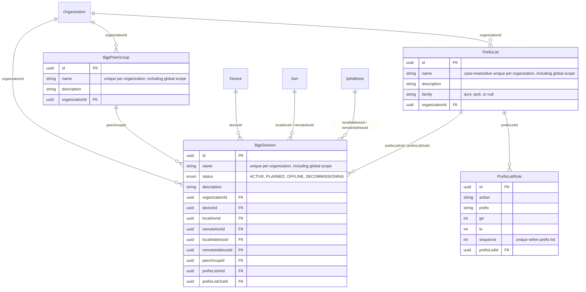
```mermaid
erDiagram
    BgpPeerGroup {
        uuid id PK
        string name "unique per organization, including global scope"
        string description
        uuid organizationId FK
    }

    PrefixList {
        uuid id PK
        string name "case-insensitive unique per organization, including global scope"
        string description
        string family "ipv4, ipv6, or null"
        uuid organizationId FK
    }

    PrefixListRule {
        uuid id PK
        string action
        string prefix
        int ge
        int le
        int sequence "unique within prefix list"
        uuid prefixListId FK
    }

    BgpSession {
        uuid id PK
        string name "unique per organization, including global scope"
        enum status "ACTIVE, PLANNED, OFFLINE, DECOMMISSIONING"
        string description
        uuid organizationId FK
        uuid deviceId FK
        uuid localAsnId FK
        uuid remoteAsnId FK
        uuid localAddressId FK
        uuid remoteAddressId FK
        uuid peerGroupId FK
        uuid prefixListInId FK
        uuid prefixListOutId FK
    }

    Organization ||--o{ BgpPeerGroup : "organizationId"
    Organization ||--o{ PrefixList : "organizationId"
    Organization ||--o{ BgpSession : "organizationId"
    BgpPeerGroup ||--o{ BgpSession : "peerGroupId"
    PrefixList ||--o{ PrefixListRule : "prefixListId"
    Device ||--o{ BgpSession : "deviceId"
    Asn ||--o{ BgpSession : "localAsnId / remoteAsnId"
    IpAddress ||--o{ BgpSession : "localAddressId / remoteAddressId"
    PrefixList ||--o{ BgpSession : "prefixListInId / prefixListOutId"
```

## In-App Notifications

One inbox row per recipient user. Deduped by `(userId, idempotencyKey)`. Optional
`organizationId` scopes a row to an org; null means unscoped (shown under any org filter).

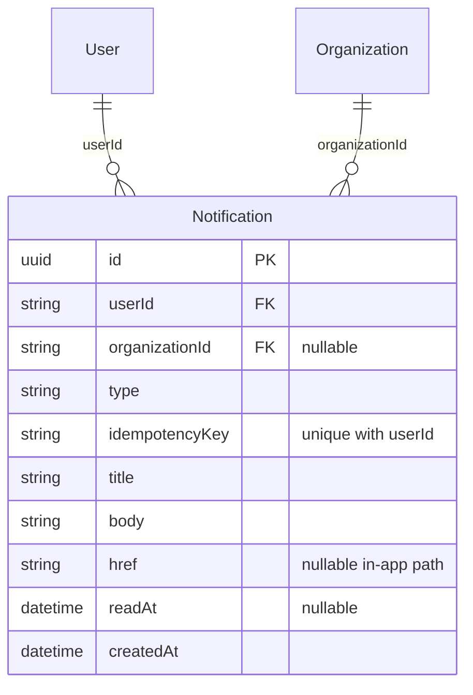
```mermaid
erDiagram
    Notification {
        uuid id PK
        string userId FK
        string organizationId FK "nullable"
        string type
        string idempotencyKey "unique with userId"
        string title
        string body
        string href "nullable in-app path"
        datetime readAt "nullable"
        datetime createdAt
    }

    User ||--o{ Notification : "userId"
    Organization ||--o{ Notification : "organizationId"
```
